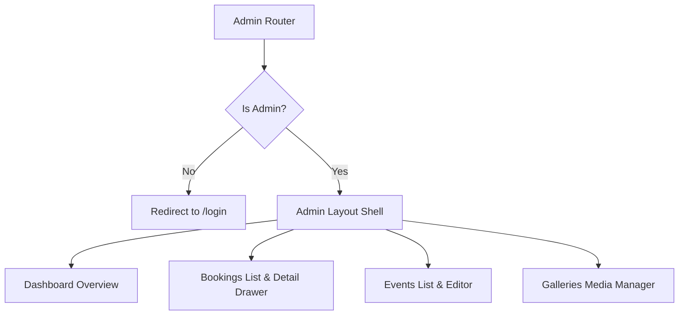

# Plan: Admin CMS Dashboard Buildout

## I. Executive Summary
- **Goal**: Implement a fully responsive, pixel-perfect, and highly interactive Admin CMS dashboard under `/admin` based on the reference design files, using Tailwind CSS utility classes and component-first architecture in React/Next.js.
- **Success Metrics**:
  - Parity with reference layout structure, typography hierarchy, and color scheme.
  - Active admin route protection that redirects non-administrators to the login flow.
  - Fully functional search, sorting, filtering, drawer overlays, dialog forms, and media upload simulation.
  - Integration of Apache ECharts for the bookings volume chart.

## II. Skill Matrix
| Component | Required Skill | Implementation Role |
|-----------|----------------|----------------------|
| Tailwind Styling | `tailwindcss-development` | Designing responsive grids, sidebar layout, tables, drawers, forms, and cards. |
| Page Logic & Routing | `modern-web-guidance` | Standard state management, mock data handling, forms, dropzones, and charts. |
| API Integration | `wayfinder-development` | Resolving routes and querying user role/resource data from the Laravel backend. |

## III. Logic & Architecture

The client-side `AdminLayout` will retrieve the authenticated user profile from `/api/puncak/me`. It checks the newly exposed `role` field on the user model. If `role === 'admin'`, the dashboard is rendered; otherwise, the user is redirected.

---

## IV. Phased Roadmap

## Stage 1: Backend Role Exposure & Admin Guard
> **Entry Condition**: Frontend and backend compile with zero errors. User is logged in.
> **Exit Condition**: Non-admin users are blocked from `/admin`, while admins can access the shell successfully.

### Module 1.1: Backend User Role Exposure
- [ ] [P1.1.1] Update User Resource: Add `'role' => $this->role` in `UserResource.php` on the backend.
      depends_on: none
      Verify: `GET /api/v1/me` returns the user's role field.
- [ ] [P1.1.2] Format Backend: Run `vendor/bin/pint --dirty --format agent` on the backend codebase.
      depends_on: P1.1.1
      Verify: Backend Pint formatting passes.

### Module 1.2: Client Auth Guard & Admin Layout
- [ ] [P1.2.1] Update Type Definitions: Add `role?: string` to `StoredAuth` and profile fetching in the frontend `src/lib/client-auth.ts` and `src/lib/puncak-api.ts`.
      depends_on: P1.1.1
      Verify: Profile interface types compile with role field.
- [ ] [P1.2.2] Build Admin Shell Layout: Create `src/components/admin/admin-layout.tsx` containing sidebar rail, header topbar, and main scroll area styled with Tailwind.
      depends_on: P1.2.1
      Verify: Layout renders logo, sidebar navigation links, topbar breadcrumbs, and user dropdown.
- [ ] [P1.2.3] Build Guard Wrapper: Create a wrapper in `src/app/admin/layout.tsx` to read user auth state. If not logged in or `role !== 'admin'`, redirect to `/login?return_to=/admin`.
      depends_on: P1.2.2
      Verify: Accessing `/admin` redirects non-admins.

### 🧪 Stage 1 Test Procedures

#### Test 1.1: Expose Role on Me Endpoint
- **Type**: E2E / Manual
- **Preconditions**: Backend is running locally.
- **Steps**:
  1. Perform a `GET` request on `http://api-puncak-traveller.test/api/v1/me` with a valid Sanctum bearer token.
  2. Inspect the JSON body returned.
- **Expected Result**: The JSON payload has `data.role` set (e.g. `'admin'` or `'member'`).
- **Fail Indicators**: `role` field missing, or endpoint returns a 500 error.

#### Test 1.2: Route Authorization Guard
- **Type**: Manual
- **Preconditions**: User is signed in as a standard member.
- **Steps**:
  1. Open browser to `/admin`.
  2. Observe page destination.
- **Expected Result**: Page redirects immediately to `/login?return_to=/admin` or `/account` with an authorization notice.
- **Fail Indicators**: The admin shell renders anyway, or a blank page hangs.

---

## Stage 2: Dashboard Overview & Chart Widget
> **Entry Condition**: Stage 1 auth check and admin layout wrapper pass successfully.
> **Exit Condition**: The main admin dashboard renders with four stat cards, ECharts visual widget, recent bookings, and list summaries.

### Module 2.1: Setup ECharts Dependency
- [ ] [P2.1.1] Install ECharts Package: Run package install for Apache ECharts and React bindings.
      depends_on: none
      Verify: `package.json` contains `echarts` and `echarts-for-react`.

### Module 2.2: Dashboard Core
- [ ] [P2.2.1] Dashboard Page Structure: Create `/admin/page.tsx` rendering main content block, metrics grids, and columns.
      depends_on: P2.1.1
      Verify: Core grids render successfully.
- [ ] [P2.2.2] Stat Cards: Implement the 4 stat cards (Upcoming Events, Bookings, Tickets Sold, Revenue) with indicators matching reference.
      depends_on: P2.2.1
      Verify: Cards display metric numbers and percentage arrows.
- [ ] [P2.2.3] ECharts Bookings Volume: Build ECharts line/bar graph inside the "Bookings volume" card.
      depends_on: P2.2.2
      Verify: Chart visualizes historical booking counts dynamically with custom tooltips.
- [ ] [P2.2.4] Recent Bookings & Lists: Implement the left-column table for bookings summary and right-column summary feeds (Upcoming Events list with progress bars, Inbox summary).
      depends_on: P2.2.3
      Verify: Recent items render with correct visual layout.

### 🧪 Stage 2 Test Procedures

#### Test 2.1: Dashboard Rendering
- **Type**: Manual
- **Preconditions**: Signed in as admin.
- **Steps**:
  1. Go to `/admin`.
  2. Confirm rendering of stats and columns.
- **Expected Result**: 4 stat cards render, Apache ECharts loads, table rows and progress bars display without layout breakages.
- **Fail Indicators**: Chart crashes to render, grid collapses on mobile viewports.

---

## Stage 3: Bookings Management & Detail Drawer
> **Entry Condition**: Stage 2 completes successfully.
> **Exit Condition**: Bookings page displays fully searchable tables, active filter tabs, and drawer detail slide-over.

### Module 3.1: Bookings List Page
- [ ] [P3.1.1] Core Bookings Page: Create `/admin/bookings/page.tsx` displaying the booking table and toolbar.
      depends_on: none
      Verify: List loads booking rows with avatars, tags, and status pills.
- [ ] [P3.1.2] Toolbar Filtering: Wire search input, filter chips (All, Paid, Pending, Cancelled, Refunded) and date filter selector.
      depends_on: P3.1.1
      Verify: Selecting chips filters table rows in real-time.

### Module 3.2: Booking Detail Drawer
- [ ] [P3.2.1] Drawer Shell: Create `src/components/admin/booking-detail-drawer.tsx` using dialog/portal triggers.
      depends_on: P3.1.1
      Verify: Click on any table row triggers drawer animation from the right side.
- [ ] [P3.2.2] Drawer Sections: Implement Member Info, Event info, Ticket breakdown table, Subtotal, and Timeline.
      depends_on: P3.2.1
      Verify: Visual representation matches the drawer design file.
- [ ] [P3.2.3] Mock Action Handles: Hook up "Resend", "Refund", "View ticket" actions to local state variables.
      depends_on: P3.2.2
      Verify: Clicking "Refund" updates booking status pill to "Refunded" and shows success feedback.

### 🧪 Stage 3 Test Procedures

#### Test 3.1: Toolbar & Search Filter
- **Type**: Manual
- **Preconditions**: Booking page is loaded.
- **Steps**:
  1. Type "Maya" in search bar.
  2. Select "Pending" status chip.
- **Expected Result**: Table shows only entries containing matching queries and statuses.
- **Fail Indicators**: Table entries don't update or search fails to filter.

#### Test 3.2: Drawer Opening & Status State Update
- **Type**: Manual
- **Preconditions**: Admin booking page is open.
- **Steps**:
  1. Click on row `PTR-26-8F3K2A`.
  2. Observe drawer slide-over.
  3. Click "Refund" button in drawer footer.
- **Expected Result**: Drawer slides over from right. Clicking "Refund" triggers status pill change to "Refunded" inside both the drawer and table row.
- **Fail Indicators**: Drawer doesn't open, state is not synced, or action fails.

---

## Stage 4: Events Management & Form Editor
> **Entry Condition**: Stage 3 completes successfully.
> **Exit Condition**: Event list table and event details form editor work flawlessly.

### Module 4.1: Events List Page
- [ ] [P4.1.1] Core Events Page: Create `/admin/events/page.tsx` displaying the event list table.
      depends_on: none
      Verify: Renders event category icons, dates, status badges, progress bars, and action links.

### Module 4.2: Event Form Editor
- [ ] [P4.2.1] Edit Event Page Layout: Create `/admin/events/[slug]/edit/page.tsx` mapping forms into left and right grid sections.
      depends_on: P4.1.1
      Verify: Standard route returns details of specific event slug.
- [ ] [P4.2.2] Form Fields & Dropzone: Implement Details cards, Date & Place fields, Dropzone image manager, Ticket tiers rows (with Add/Remove type options), and Publish Status choice cards.
      depends_on: P4.2.1
      Verify: Inputs render with correct placeholder/prefilled values.
- [ ] [P4.2.3] Mock Submit Logic: Bind buttons (Publish Changes, Save Draft, Delete Event) to notify local changes.
      depends_on: P4.2.2
      Verify: Clicking publish yields success state toast.

### 🧪 Stage 4 Test Procedures

#### Test 4.1: Event Ticket Addition
- **Type**: Manual
- **Preconditions**: Event Editor page is open for `puncak-trail-run-2026`.
- **Steps**:
  1. Click "Add type" button.
  2. Input: Name="Ultra 50K", Price="350000", Capacity="50".
  3. Click "Publish changes".
- **Expected Result**: A new ticket row is appended. Success toast appears.
- **Fail Indicators**: Addition button is non-interactive, or inputs don't bind.

---

## Stage 5: Galleries & Media Manager
> **Entry Condition**: Stage 4 completes successfully.
> **Exit Condition**: Image gallery grid loads dynamically with selection bars and mock file uploads.

### Module 5.1: Media Grid & Actions
- [ ] [P5.1.1] Core Galleries Page: Create `/admin/galleries/page.tsx` showing the media grid tiles.
      depends_on: none
      Verify: Gallery images render with captions and linked event tags.
- [ ] [P5.1.2] Bulk Actions: Wire selection logic. When tiles are checked, show the black bulk action bar.
      depends_on: P5.1.1
      Verify: Bar counts active items, has Link/Download/Delete options, and close triggers.

### Module 5.2: Image Upload Area
- [ ] [P5.1.3] Dropzone Upload: Implement the first grid card as an upload box. Hook up standard file selection callback.
      depends_on: P5.1.2
      Verify: Selecting a photo mocks upload progress bar and adds it as a tile.

### 🧪 Stage 5 Test Procedures

#### Test 5.1: Bulk Action Bar Selection
- **Type**: Manual
- **Preconditions**: Galleries page is open.
- **Steps**:
  1. Check 3 image tiles.
  2. Observe bulk action bar visibility and number counts.
  3. Click "Deselect all".
- **Expected Result**: Bulk action bar appears showing "3 photos selected". Clicking deselect hides the bar.
- **Fail Indicators**: Bar doesn't show up, or counts are inaccurate.

#### Test 5.2: Simulated File Upload
- **Type**: Manual
- **Preconditions**: Galleries page is open.
- **Steps**:
  1. Select a file from the upload tile.
- **Expected Result**: A simulated progress bar counts up to 100%, and the uploaded photo is appended to the grid.
- **Fail Indicators**: Dropzone has no upload indicator, or file is not added to grid.

---

## V. Final Verification Checklist
- [ ] Test the auth guard using a standard member token. Verify redirect to `/login?return_to=/admin` works.
- [ ] Log in as admin and verify the dashboard overview opens correctly.
- [ ] Inspect the Apache ECharts graph: confirm look and feel align with reference styling.
- [ ] Open bookings table, search "Maya", click the row, verify drawer details load.
- [ ] Click "Refund" in drawer, check if row updates to "Refunded".
- [ ] Open events list, click edit on Puncak Trail Run 2026. Make an update and click publish.
- [ ] Navigate to galleries, select 3 photos, check bulk action bar, deselect all.
- [ ] Upload a test photo, verify progress indicator completes and appends tile.
- [ ] Validate site responsive formatting on desktop, tablet, and mobile screens.
