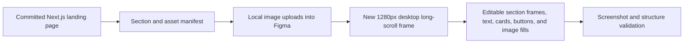

# Figma Landing Page Migration

## I. Executive Summary

- **Goal**: Create one static, editable desktop Figma frame on the existing `Web` page that mirrors the committed Next.js Puncak Travellers landing page.
- **Success Metrics**:
  - New frame is created in the target Figma file without modifying or replacing existing app frames.
  - The frame uses a 1280px desktop long-scroll layout and contains all landing sections from the committed Next.js page.
  - Local landing images are applied as Figma image fills, and final screenshot review shows no missing imagery, clipped text, or incoherent overlap.

## II. Skill Matrix

| Component | Required Skill | Implementation Role |
|-----------|----------------|----------------------|
| Planning and approval gate | `planner` | Produces this staged roadmap and blocks implementation until approval. |
| Figma file inspection and creation | `figma:figma-use` | Executes safe incremental Plugin API scripts, returns node IDs, and validates frame structure. |
| Figma screen assembly workflow | `figma-generate-design` | Guides source-to-Figma migration, design system discovery, asset strategy, and section-by-section assembly. |
| Landing page visual fidelity | `frontend-design` | Keeps the migrated frame faithful to the committed page's typography, spacing, imagery, hierarchy, and polish. |

## III. Logic & Architecture

The migration is a one-way design transfer from the committed Next.js landing page into the existing Figma design file.

Implementation targets:

- Figma file: `Skl9kOTRGLmfHDvyaDJKKB`
- Target page: `Web`
- Existing linked node ancestry confirms the page context: `Web > Login - Puncak Runners > ... > Gradient`
- New frame name: `Landing Page - Puncak Travellers (Desktop)`
- New frame placement: to the right of the rightmost existing top-level frame on `Web`
- Source of truth: committed Next.js page, not the older Figma `Home` frame and not the raw reference HTML
- Deliverable scope: one static editable desktop frame only, no prototype links, no hover variants, no interaction wiring

## IV. Phased Roadmap

## Stage 1: Source and Figma Re-Audit

> **Entry Condition**: User has approved this roadmap.
> **Exit Condition**: The exact source sections, visible assets, target page, and placement coordinates are confirmed immediately before any Figma write.

### Module 1.1: Source Manifest

- [ ] [P1.1.1] Confirm Current Commit Source: Read `src/app/page.tsx`, `src/components/landing/sections.tsx`, `src/components/landing/data.ts`, and `src/app/globals.css` to confirm the committed landing page structure and visual tokens.
      depends_on: none
      Verify: The manifest lists Header, Hero, Events, Activities, Live Event, Communities, Booking Steps, Gallery, Final CTA, and Footer.

- [ ] [P1.1.2] Extract Visible Asset Manifest: Derive the unique visible `public/landing` image paths referenced by the committed source.
      depends_on: P1.1.1
      Verify: The manifest includes every image referenced by the rendered landing page and excludes unused files such as assets not referenced by source.

- [ ] [P1.1.3] Measure Desktop Page Shape: Use the running local app or source CSS to confirm the expected 1280px desktop long-scroll composition, section order, and approximate total height.
      depends_on: P1.1.1
      Verify: A numeric target frame width and height are recorded before creating the Figma frame.

### Module 1.2: Figma Environment

- [ ] [P1.2.1] Reconfirm Target Page: Run a read-only `use_figma` inspection for node `301:532`, switch once to its parent page with `await figma.setCurrentPageAsync(page)`, and return page details.
      depends_on: none
      Verify: Returned page name is `Web`, editor type is `figma`, and target ancestry still resolves to the same page.

- [ ] [P1.2.2] Reconfirm Design System Availability: Inspect local variables, local styles, and existing instances on the `Web` page.
      depends_on: P1.2.1
      Verify: Results identify any reusable local components or confirm that exact-style editable primitives are required.

- [ ] [P1.2.3] Calculate Safe Placement: Find the rightmost top-level visible node on the `Web` page and calculate a new `x` position with clear spacing.
      depends_on: P1.2.1
      Verify: Placement result includes `x`, `y`, and confirms no overlap with existing frames.

### 🧪 Stage 1 Test Procedures

#### Test 1.1: Source Manifest Completeness
- **Type**: Manual
- **Preconditions**: Source files have been inspected.
- **Steps**:
  1. Compare the section manifest against `src/app/page.tsx`.
  2. Compare each section's content against `src/components/landing/sections.tsx` and `src/components/landing/data.ts`.
- **Expected Result**: Every visible section and all card/gallery data are represented in the Figma build manifest.
- **Pass Command**: N/A
- **Fail Indicators**: Missing landing section, stale copy, missing CTA, or missing image path.

#### Test 1.2: Figma Page Target Is Stable
- **Type**: Integration
- **Preconditions**: Figma MCP server is connected and the target file is accessible.
- **Steps**:
  1. Run read-only `use_figma` against file `Skl9kOTRGLmfHDvyaDJKKB`.
  2. Resolve node `301:532`.
  3. Switch once to its parent page.
  4. Return page name and top-level nodes.
- **Expected Result**: The page is `Web`, and a new placement coordinate can be calculated without colliding with existing top-level frames.
- **Pass Command**: `use_figma` read-only inspection
- **Fail Indicators**: Target node missing, page mismatch, permission error, or no safe top-level placement.

## Stage 2: Image Fill Preparation

> **Entry Condition**: Stage 1 confirms the source manifest and target Figma page.
> **Exit Condition**: All required landing images are available in the Figma file as image fills or image hashes ready for use in the final frame.

### Module 2.1: Asset Upload Strategy

- [ ] [P2.1.1] Prepare Upload Batch List: Map each required local image path to the destination Figma image role such as hero, event card, activity card, live visual, community card, gallery item, or CTA.
      depends_on: P1.1.2
      Verify: Every required image role has an absolute local file path and destination role.

- [ ] [P2.1.2] Upload Local Images: Use the Figma asset upload workflow to upload the required image files from `public/landing`.
      depends_on: P2.1.1, P1.2.1
      Verify: Each upload returns or creates a Figma image fill source that can be referenced by `use_figma`.

- [ ] [P2.1.3] Build Image Hash Map: Run `use_figma` to inspect uploaded image-filled nodes or destination image nodes and return a role-to-imageHash map.
      depends_on: P2.1.2
      Verify: The returned map has no missing image roles and every image hash is non-empty.

### Module 2.2: Asset Staging Cleanup

- [ ] [P2.2.1] Organize Temporary Asset Nodes: If uploads create staging frames, rename and group them under an off-canvas `PT Landing Asset Staging` area.
      depends_on: P2.1.3
      Verify: Staging nodes are named, visible for audit, and do not overlap existing or final frames.

- [ ] [P2.2.2] Confirm No Blank Image Dependencies: Verify that final frame construction can use uploaded image hashes instead of external URLs.
      depends_on: P2.1.3
      Verify: The image hash map is sufficient to build all visible image fills.

### 🧪 Stage 2 Test Procedures

#### Test 2.1: Image Upload Completeness
- **Type**: Integration
- **Preconditions**: Required local images exist in `public/landing`.
- **Steps**:
  1. Upload the asset batch using the Figma MCP upload flow.
  2. Inspect image-filled nodes or destination nodes with `use_figma`.
  3. Return `{ role, imageHash }` for every required image role.
- **Expected Result**: Every required landing image role has a usable Figma image hash.
- **Pass Command**: Figma asset upload flow plus `use_figma` image fill inspection
- **Fail Indicators**: Missing local file, failed upload, empty image hash, or a role without a mapped image.

#### Test 2.2: Staging Does Not Pollute the Layout
- **Type**: Manual
- **Preconditions**: Image staging nodes have been created or identified.
- **Steps**:
  1. Inspect the `Web` page top-level node list.
  2. Confirm staging nodes are named and positioned away from existing frames and the final frame.
- **Expected Result**: Temporary asset nodes are discoverable and non-overlapping.
- **Pass Command**: `use_figma` top-level node inspection
- **Fail Indicators**: Unnamed upload frames, upload frames overlapping app frames, or staging images mixed into the final landing frame hierarchy.

## Stage 3: Frame Skeleton and Design Tokens

> **Entry Condition**: Stage 2 provides all required Figma image hashes.
> **Exit Condition**: A new desktop long-scroll frame exists on the `Web` page with section frames, global styles, and placeholders ready for content.

### Module 3.1: Top-Level Frame

- [ ] [P3.1.1] Create Desktop Frame: Create a top-level frame named `Landing Page - Puncak Travellers (Desktop)` at the safe placement coordinate.
      depends_on: P1.2.3, P1.1.3
      Verify: Frame width is `1280`, height matches the measured desktop page plan, and the returned created node ID is recorded.

- [ ] [P3.1.2] Add Global Background: Apply the committed page background treatment using editable fills and subtle large-scale gradients where supported by Figma.
      depends_on: P3.1.1
      Verify: The frame background visually matches the warm cream landing page base.

- [ ] [P3.1.3] Create Section Skeleton: Add editable child frames for Header, Hero, Events, Activities, Live Event, Communities, Booking Steps, Gallery, Final CTA, and Footer.
      depends_on: P3.1.1
      Verify: The final frame contains named child frames for every landing page section in source order.

### Module 3.2: Shared Visual Primitives

- [ ] [P3.2.1] Define Local Build Constants: In the `use_figma` script, define reusable color, radius, shadow, spacing, and typography constants that match `globals.css`.
      depends_on: P1.1.1
      Verify: Constants include orange, teal, navy, slate, gray, cream, white, shared radii, and card shadows.

- [ ] [P3.2.2] Verify Fonts Before Text Creation: Use `figma.listAvailableFontsAsync()` and load verified font names before every text mutation.
      depends_on: P3.2.1
      Verify: Font loading succeeds for the selected display and body fonts or documented closest available fallbacks.

- [ ] [P3.2.3] Create Reusable Helper Functions: Implement helper functions inside the Figma script for text nodes, buttons, badges, cards, image fills, and section headings.
      depends_on: P3.2.1, P3.2.2
      Verify: Helper functions create editable nodes and return all created IDs through the script response.

### 🧪 Stage 3 Test Procedures

#### Test 3.1: Frame Skeleton Structure
- **Type**: Integration
- **Preconditions**: New frame and child section frames have been created.
- **Steps**:
  1. Run `use_figma` read-only validation on the new frame ID.
  2. Return frame dimensions, child section names, and section count.
- **Expected Result**: One new 1280px desktop frame exists with all expected section frames in source order.
- **Pass Command**: `use_figma` frame hierarchy inspection
- **Fail Indicators**: Wrong width, missing section, duplicated section, frame at wrong page level, or overlap with existing frames.

#### Test 3.2: Text Creation Safety
- **Type**: Integration
- **Preconditions**: Font discovery has run.
- **Steps**:
  1. Load all font styles used by the build script.
  2. Create a sample hidden or temporary text node in the new frame.
  3. Remove the sample node after validation.
- **Expected Result**: Text creation and mutation succeeds without unloaded font errors.
- **Pass Command**: `use_figma` font validation script
- **Fail Indicators**: `Cannot write to node with unloaded font`, incorrect style name, or missing font fallback not documented.

## Stage 4: Section-by-Section Content Build

> **Entry Condition**: Stage 3 creates the frame skeleton and reusable helpers.
> **Exit Condition**: All visible landing page sections are populated with editable text, shapes, cards, buttons, vectors, and image fills.

### Module 4.1: Header and Hero

- [ ] [P4.1.1] Build Header: Create the fixed-style header representation with logo, nav links, and Login/Register actions matching the committed page.
      depends_on: P3.2.3
      Verify: Header has editable text, logo mark, rounded glass container, and correct navigation labels.

- [ ] [P4.1.2] Build Hero Media Layer: Add the hero background image fill, overlay gradients, badge, headline, lead text, actions, location pill, and stat tiles.
      depends_on: P4.1.1, P2.1.3
      Verify: Hero visually matches the committed desktop first viewport and uses the uploaded hero image fill.

### Module 4.2: Event and Activity Sections

- [ ] [P4.2.1] Build Upcoming Events Section: Add heading, action link, and three editable event cards using data from the committed source.
      depends_on: P4.1.2, P2.1.3
      Verify: Event card titles, dates, locations, prices, badges, buttons, and images match source data.

- [ ] [P4.2.2] Build Activities Section: Add heading and four activity cards with image fills, icon treatments, counts, and tonal overlays.
      depends_on: P4.2.1, P2.1.3
      Verify: Activity labels and counts match source data, and all four cards use image fills.

### Module 4.3: Live, Communities, and Booking Sections

- [ ] [P4.3.1] Build Live Event Section: Add live copy, badge, live stats, CTAs, large live trail image, and orbit pill.
      depends_on: P4.2.2, P2.1.3
      Verify: Live section includes `Forest Fun Run 10K`, three stat tiles, and the uploaded live trail image.

- [ ] [P4.3.2] Build Communities Section: Add section heading, action link, and three community cards.
      depends_on: P4.3.1, P2.1.3
      Verify: Community titles, member counts, descriptions, and images match source data.

- [ ] [P4.3.3] Build Booking Steps Section: Add dark navy section, sticky-style intro representation, and three large numbered step cards.
      depends_on: P4.3.2
      Verify: Step numbers, titles, and descriptions match committed source data.

### Module 4.4: Gallery, Final CTA, and Footer

- [ ] [P4.4.1] Build Gallery Section: Add section heading, gallery action, and five staggered gallery image figures with numeric labels.
      depends_on: P4.3.3, P2.1.3
      Verify: Gallery labels, numbering, staggered sizing, and image fills match source.

- [ ] [P4.4.2] Build Final CTA Section: Add mountain CTA background image, overlays, heading, supporting text, and two CTA buttons.
      depends_on: P4.4.1, P2.1.3
      Verify: CTA image, copy, and actions match source and remain editable.

- [ ] [P4.4.3] Build Footer: Add footer logo, description, link groups, legal links, and social/contact placeholders as editable text and simple vector icons.
      depends_on: P4.4.2
      Verify: Footer group headings and links match `footerGroups` data.

### 🧪 Stage 4 Test Procedures

#### Test 4.1: Content Parity
- **Type**: Manual
- **Preconditions**: All sections have been populated.
- **Steps**:
  1. Compare Figma section names and visible copy against the committed source data.
  2. Verify every event, activity, community, booking step, gallery label, CTA, and footer group is present.
- **Expected Result**: The Figma frame contains all visible committed page content with no missing sections.
- **Pass Command**: N/A
- **Fail Indicators**: Missing card, wrong event title, stale copy from older Figma page, missing button, or missing footer link group.

#### Test 4.2: Image Fill Parity
- **Type**: Integration
- **Preconditions**: Content sections are populated.
- **Steps**:
  1. Run `use_figma` validation on the final frame.
  2. Count image-filled rectangles/frames used by Hero, Events, Activities, Live, Communities, Gallery, and CTA.
  3. Return missing or blank image nodes.
- **Expected Result**: Every visible image slot has a non-empty Figma image fill.
- **Pass Command**: `use_figma` image fill validation
- **Fail Indicators**: Solid-color placeholder where an image should be, empty image hash, or mismatched image role.

## Stage 5: Visual Refinement and Final Validation

> **Entry Condition**: Stage 4 completes all visible content.
> **Exit Condition**: The new static editable Figma landing frame is visually validated and ready for user review.

### Module 5.1: Layout Refinement

- [ ] [P5.1.1] Normalize Spacing and Alignment: Adjust section heights, container widths, card gaps, and text widths to match the committed desktop design.
      depends_on: P4.4.3
      Verify: No text overlaps, card grid spacing is consistent, and each section has clear vertical rhythm.

- [ ] [P5.1.2] Refine Typography and Shadows: Tune heading sizes, paragraph sizes, line heights, card shadows, overlays, and radii against the committed landing page style.
      depends_on: P5.1.1
      Verify: Screenshot review shows the design reads as the same Puncak Travellers landing page style.

- [ ] [P5.1.3] Remove In-Progress Placeholders: Ensure any `placeholder = true` states, temporary test nodes, or accidental staging artifacts inside the final frame are removed.
      depends_on: P5.1.2
      Verify: Final frame has no shimmer placeholders, test nodes, or staging children.

### Module 5.2: Final Figma Verification

- [ ] [P5.2.1] Capture Final Frame Screenshot: Use `get_screenshot` or `await node.screenshot()` on the final frame for visual inspection.
      depends_on: P5.1.3
      Verify: Screenshot renders the full long-scroll frame with image fills and section hierarchy visible.

- [ ] [P5.2.2] Run Structural Validation: Run `use_figma` validation returning frame dimensions, section count, image fill count, text node count, and top-level page placement.
      depends_on: P5.2.1
      Verify: Validation output confirms the frame is one top-level node on `Web`, width is `1280`, and expected sections are present.

- [ ] [P5.2.3] Select and Focus Final Frame: Select the completed frame and adjust viewport focus for user review.
      depends_on: P5.2.2
      Verify: Figma opens with the new frame selected or discoverable by name on the `Web` page.

### 🧪 Stage 5 Test Procedures

#### Test 5.1: Final Screenshot Review
- **Type**: Manual
- **Preconditions**: Final screenshot has been captured.
- **Steps**:
  1. Inspect the screenshot from top to bottom.
  2. Check hero, card grids, dark booking section, gallery, CTA, and footer.
  3. Note any clipped text, blank image, excessive overlap, or wrong section ordering.
- **Expected Result**: Screenshot shows a polished desktop long-scroll landing page matching the committed Next.js design.
- **Pass Command**: `get_screenshot` or `await frame.screenshot()`
- **Fail Indicators**: Blank image fills, cropped headline, hidden footer, unreadable card text, or section order mismatch.

#### Test 5.2: Final Structure Check
- **Type**: Integration
- **Preconditions**: Final frame exists.
- **Steps**:
  1. Run a read-only `use_figma` script against the final frame ID.
  2. Return top-level frame dimensions, child section names, and image fill summary.
  3. Confirm no existing Figma frames were removed or renamed.
- **Expected Result**: One new desktop landing frame exists on `Web`, existing frames remain intact, and all expected sections are represented.
- **Pass Command**: `use_figma` final validation script
- **Fail Indicators**: Existing frame mutation, wrong frame size, missing section, missing image fills, or unresolved placeholders.

## V. Final Verification Checklist

- [ ] New frame is named `Landing Page - Puncak Travellers (Desktop)`.
- [ ] New frame is placed on the existing `Web` page and does not replace the older `Home` or app prototype frames.
- [ ] Frame width is `1280px`; height is sufficient for the full long-scroll desktop landing page.
- [ ] All committed Next.js landing sections are present in source order.
- [ ] All visible local images from the committed landing page are applied as Figma image fills.
- [ ] Text, buttons, cards, badges, and section containers are editable Figma nodes, not a single raster screenshot.
- [ ] No prototype interactions, hover variants, or navigation wiring are added.
- [ ] Final screenshot review shows no clipped text, missing imagery, or incoherent overlaps.
- [ ] Final `use_figma` validation returns all created/mutated node IDs and confirms existing frames remain intact.
