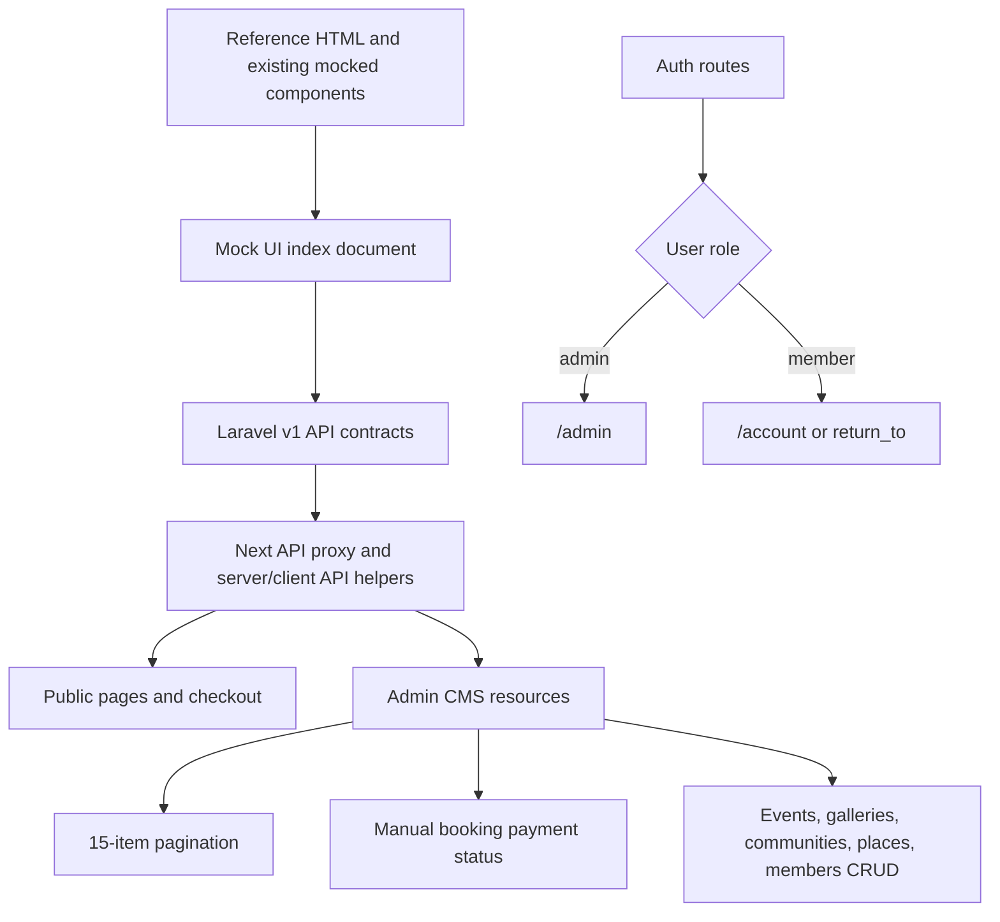

# Plan: Full-Stack Dynamic CMS, Auth, and Mock UI Completion

## I. Executive Summary
- **Goal**: Replace mocked Puncak Travellers public, checkout, and CMS behavior with dynamic API-backed features across the Next.js frontend and Laravel backend.
- **Success Metrics**:
  - Public, checkout, account, and CMS screens render API data with explicit empty states for no data and error states for request failures.
  - Auth supports member signup, login redirects admins to `/admin`, profile dropdowns, logout, and Gmail SMTP-backed password reset.
  - Admin CMS supports functional events, bookings, galleries, communities, places, and members CRUD with 15-item pagination and no global/header search or filter/sort UI.

## II. Skill Matrix
| Component | Required Skill | Implementation Role |
|-----------|----------------|---------------------|
| Roadmap & dependency sequencing | `planner` | Defines full-stack stages, explicit dependencies, and self-contained test procedures before implementation. |
| Public and CMS UI refinement | `frontend-design` | Keeps profile dropdowns, auth pages, CMS resource pages, empty/error states, and pagination visually consistent and production-grade. |
| React animation lifecycle | `gsap-react` | Ensures any retained page/dropdown/reveal animation runs only on the client with scoped refs and cleanup. |
| GSAP animation primitives | `gsap-core` | Keeps existing GSAP usage performant, transform-based, and accessible with reduced-motion handling. |
| Next.js App Router docs | `node_modules/next/dist/docs/01-app/...` | Required by repo instruction before App Router route handler, redirect, fetch, auth, and form edits. |
| Laravel API conventions | Existing Laravel controllers, resources, requests, seeders | Adds auth, resource CRUD, pagination, gallery download/update, booking payment status, and seed data using local backend patterns. |

## III. Logic & Architecture

Primary implementation happens in two repos:
- Frontend: `/Users/aliceevr/Documents/Workspace/SV IPB University/Puncak Traveller/frontend-puncak-traveller`
- Backend: `/Users/aliceevr/Documents/Workspace/SV IPB University/Puncak Traveller/api-puncak-traveller`

Conventions fixed by user answers:
- Signup fields: `name`, `email`, `password`.
- Public signup role: normal member only.
- Admin role check: exactly `admin`.
- Password reset frontend routes: `/forgot-password` and `/reset-password`.
- CMS page size: 15 items.
- Checkout creates bookings only; admins manually update payment status in CMS.
- Remove global/header search and filter/sort controls only; per-resource search can remain if already useful.
- Gallery download: single image only.
- Demo admin: `alice@puncaktraveller.id` / `aldio1234`.

## IV. Phased Roadmap

## Stage 1: Discovery, Contract Audit, and Mock UI Index
> **Entry Condition**: Both repos are present and dependencies are installed or installable.
> **Exit Condition**: A written mock UI/API index exists and implementation targets are unambiguous.

### Module 1.1: Framework and Repo Rule Audit

- [ ] [P1.1.1] Read Next App Router Docs: Read the relevant `node_modules/next/dist/docs/01-app` guides for route handlers, auth, redirecting, forms, fetch, and server/client components before frontend code edits.
      depends_on: none
      Verify: Notes in the mock UI index cite the specific docs files used for App Router decisions.

- [ ] [P1.1.2] Audit Laravel API Surface: Inventory existing v1 routes, controllers, requests, resources, models, migrations, and seeders for auth, events, bookings, galleries, communities, places, users, and password reset.
      depends_on: none
      Verify: Mock UI index includes current endpoint status: existing, partial, missing, or needs update.

- [ ] [P1.1.3] Audit Frontend Mock Sources: Inventory all pages/components importing `src/lib/reference-data.ts`, hardcoded CMS arrays, localStorage-only booking behavior, disabled CMS links, and reference HTML pages.
      depends_on: none
      Verify: `rg 'reference-data|mock|disabled|href="#"|localStorage' src references` findings are represented in the index.

### Module 1.2: Mock UI Index

- [ ] [P1.2.1] Create Mock UI Index Document: Add `Documentation/Plans/mock-ui-api-index.md` mapping each public, checkout, account, and admin mocked UI to required API endpoints and data contracts.
      depends_on: P1.1.1, P1.1.2, P1.1.3
      Verify: Document includes landing, events, event detail, galleries, about, contact, login, signup, password reset, account, checkout steps, admin dashboard, bookings, events, galleries, communities, places, and members.

- [ ] [P1.2.2] Define Empty and Error State Requirements: Record per-page empty/error behavior with user-visible copy and whether the state is server-rendered or client-rendered.
      depends_on: P1.2.1
      Verify: Every dynamic page in the index has both an empty state and an error state entry.

### Stage 1 Test Procedures

#### Test 1.1: Mock UI Index Completeness
- **Type**: Manual
- **Preconditions**: Stage 1 tasks are complete.
- **Steps**:
  1. Open `Documentation/Plans/mock-ui-api-index.md`.
  2. Compare its route list against `find src/app -maxdepth 5 -type f` and the `references/` directory.
  3. Confirm each listed UI has endpoint, data contract, empty state, and error state notes.
- **Expected Result**: No route or reference page is missing from the index, and every mocked feature has an API-backed target.
- **Fail Indicators**: Missing checkout/admin route, missing endpoint target, or no empty/error state definition.

## Stage 2: Backend Auth, Users, Password Reset, and Seed Data
> **Entry Condition**: Stage 1 index identifies auth contracts and backend gaps.
> **Exit Condition**: Laravel supports signup, login, logout, current user, password reset email flow, member CRUD, and demo seed data.

### Module 2.1: Signup and Auth Redirect Data

- [ ] [P2.1.1] Add Signup Request and Endpoint: Create Laravel request/controller logic for `POST /api/v1/auth/register` accepting `name`, `email`, and `password`, creating a member user, returning user data and token.
      depends_on: P1.2.1
      Verify: Feature test registers a member and confirms `role !== 'admin'`.

- [ ] [P2.1.2] Update Auth Resource Consistency: Ensure login, Google exchange, register, `/auth/user`, and `/me` all return consistent `id`, `name`, `email`, `role`, `avatarUrl`, and profile fields needed by navbar/account.
      depends_on: P2.1.1
      Verify: API tests confirm all auth user payloads include `role` exactly.

### Module 2.2: Password Reset with Gmail SMTP

- [ ] [P2.2.1] Add Forgot Password Endpoint: Add `POST /api/v1/auth/forgot-password` using Laravel's password broker and a frontend reset URL of `/reset-password`.
      depends_on: P2.1.2
      Verify: Feature test posts a known email and asserts password reset notification is queued/sent.

- [ ] [P2.2.2] Add Reset Password Endpoint: Add `POST /api/v1/auth/reset-password` accepting email, token, password, and password confirmation.
      depends_on: P2.2.1
      Verify: Feature test resets a user password and confirms login succeeds with the new password.

- [ ] [P2.2.3] Document Gmail SMTP Setup: Update backend `.env.example` and project docs with Gmail app-password SMTP settings.
      depends_on: P2.2.2
      Verify: Documentation includes `MAIL_MAILER=smtp`, Gmail host/port/encryption, username, app password, and from address.

### Module 2.3: Members CRUD and Demo Seeder

- [ ] [P2.3.1] Add Admin Members API: Add admin-only `users` or `members` v1 routes for index/show/store/update/delete with role/status fields and 15-item pagination.
      depends_on: P2.1.2
      Verify: Admin feature tests cover list, create, update, delete, forbidden member access, and pagination metadata.

- [ ] [P2.3.2] Update Demo Admin Seeder: Set default admin credentials to `alice@puncaktraveller.id` and `aldio1234`, while preserving env overrides.
      depends_on: P2.3.1
      Verify: `php artisan db:seed --class=AdminUserSeeder` creates or updates an admin with that email and role `admin`.

- [ ] [P2.3.3] Expand Demo Data Seeder: Seed communities, places, events, tickets, bookings, galleries, members, saved events, and image paths suitable for the public site and CMS demo.
      depends_on: P2.3.2
      Verify: `php artisan migrate:fresh --seed` produces non-empty records for all CMS resources and public pages.

### Stage 2 Test Procedures

#### Test 2.1: Auth and Signup API
- **Type**: Integration
- **Preconditions**: Backend test database is configured.
- **Steps**:
  1. Run Laravel auth feature tests for register, login, user, logout, and admin role payload.
  2. Inspect JSON response assertions.
- **Expected Result**: Register returns a token and member role, login returns role, and admin login identifies exactly `admin`.
- **Pass Command**: `php artisan test --filter=Auth`
- **Fail Indicators**: Missing token, missing role, admin role mismatch, or member signup creates admin.

#### Test 2.2: Password Reset Email Flow
- **Type**: Integration
- **Preconditions**: Mail fake is enabled in tests.
- **Steps**:
  1. Request a reset link for an existing user.
  2. Extract the token from the notification.
  3. Submit a new password through the reset endpoint.
  4. Attempt login with the new password.
- **Expected Result**: Reset notification is sent, password updates, and login succeeds with the new password.
- **Pass Command**: `php artisan test --filter=PasswordReset`
- **Fail Indicators**: No notification, invalid reset URL, token rejected, or new password login fails.

#### Test 2.3: Demo Seeder
- **Type**: Integration
- **Preconditions**: Local database can be reset.
- **Steps**:
  1. Run `php artisan migrate:fresh --seed`.
  2. Query users, events, galleries, places, communities, bookings, and ticket types.
  3. Login with `alice@puncaktraveller.id` and `aldio1234`.
- **Expected Result**: All demo tables contain records, images paths are present, and demo admin login succeeds with role `admin`.
- **Pass Command**: `php artisan migrate:fresh --seed && php artisan test --filter=Seeder`
- **Fail Indicators**: Empty CMS resource table, missing image paths, or demo admin login failure.

## Stage 3: Backend Resource CRUD, Booking Payment Status, and Gallery Fixes
> **Entry Condition**: Stage 2 auth and seed contracts are available.
> **Exit Condition**: Laravel exposes all API operations required by the public pages, checkout, and CMS.

### Module 3.1: Event CRUD Completion

- [ ] [P3.1.1] Split Event Create and Edit Contracts: Ensure backend event store/update supports all fields used by separate new and edit CMS pages, including tickets, image path/upload, place, community, publication status, schedule, includes, and summary.
      depends_on: P2.3.3
      Verify: Event store/update tests persist every edited field and ticket row.

- [ ] [P3.1.2] Add Event Admin Pagination Metadata: Standardize events index pagination metadata to `page`, `perPage`, `total`, and include 15-item default for CMS requests.
      depends_on: P3.1.1
      Verify: API test confirms `perPage` is 15 when requested by CMS.

### Module 3.2: Communities and Places CRUD

- [ ] [P3.2.1] Add Community Admin CRUD: Extend communities routes/controller/request for admin-only create, update, delete, preserving public index/show.
      depends_on: P2.3.3
      Verify: Feature tests cover admin CRUD and member forbidden access.

- [ ] [P3.2.2] Add Place Admin CRUD: Extend places routes/controller/request for admin-only create, update, delete with community linkage.
      depends_on: P3.2.1
      Verify: Feature tests cover admin CRUD, validation failures, and public read access.

### Module 3.3: Booking Payment Status

- [ ] [P3.3.1] Add Booking Payment Status Support: Add or expose payment status fields and admin-only endpoint for manual updates from CMS.
      depends_on: P2.3.3
      Verify: Feature test updates a booking payment status and response reflects the change.

- [ ] [P3.3.2] Add Admin Booking Pagination: Update booking admin index to return paginated data with 15-item CMS support.
      depends_on: P3.3.1
      Verify: API test confirms booking index returns pagination metadata and page boundaries.

### Module 3.4: Gallery Update and Download

- [ ] [P3.4.1] Add Gallery Update Endpoint: Add admin-only update support for caption/title/category/event link/image alt so CMS edit caption persists.
      depends_on: P2.3.3
      Verify: Feature test updates a caption and subsequent show/index responses include the new value.

- [ ] [P3.4.2] Add Single Gallery Download Endpoint: Add authenticated admin endpoint returning the selected image file or redirecting to public image URL for one gallery item.
      depends_on: P3.4.1
      Verify: Feature test receives a file/download response for stored images and a clear error for missing files.

- [ ] [P3.4.3] Standardize Gallery Pagination: Ensure gallery index supports 15-item CMS pagination and public empty/error-friendly metadata.
      depends_on: P3.4.2
      Verify: API test confirms gallery pagination metadata and no stale mock fallback fields are required.

### Stage 3 Test Procedures

#### Test 3.1: Admin Resource CRUD
- **Type**: Integration
- **Preconditions**: Admin token and member token are available.
- **Steps**:
  1. Run API tests for events, communities, places, members, and galleries CRUD.
  2. Confirm member token cannot create/update/delete admin resources.
- **Expected Result**: Admin CRUD succeeds, public read routes still work, and member writes return 403.
- **Pass Command**: `php artisan test --filter=AdminResource`
- **Fail Indicators**: Missing endpoint, validation bypass, wrong authorization, or broken public read route.

#### Test 3.2: Booking Payment Status
- **Type**: Integration
- **Preconditions**: A pending demo booking exists.
- **Steps**:
  1. Call admin payment status update endpoint with `paid`.
  2. Fetch booking detail.
  3. Call endpoint with invalid status.
- **Expected Result**: Valid status persists and invalid status returns validation error without changing stored value.
- **Pass Command**: `php artisan test --filter=BookingPaymentStatus`
- **Fail Indicators**: Status not persisted, non-admin can update, or invalid status accepted.

#### Test 3.3: Gallery Caption and Download
- **Type**: Integration
- **Preconditions**: A seeded gallery item exists.
- **Steps**:
  1. Update the gallery caption through the API.
  2. Fetch the gallery item and confirm caption changed.
  3. Request single-image download endpoint.
- **Expected Result**: Caption persists and download returns a file response or valid image redirect.
- **Pass Command**: `php artisan test --filter=Gallery`
- **Fail Indicators**: Caption remains old, download 404s for valid image, or response has wrong content type.

## Stage 4: Frontend Auth, Navbar, Checkout, and Public Dynamic Pages
> **Entry Condition**: Stage 2 and Stage 3 backend contracts are implemented or available through the Next proxy.
> **Exit Condition**: Public and checkout pages use API data with auth-aware navigation and explicit empty/error states.

### Module 4.1: Frontend API Client and State Contracts

- [ ] [P4.1.1] Update Frontend API Helpers: Add typed helpers for auth register, forgot/reset password, paginated resources, booking creation, payment-aware bookings, and gallery download.
      depends_on: P2.2.2, P3.4.2
      Verify: TypeScript compiles and helpers use `cache: "no-store"` where dynamic data requires it.

- [ ] [P4.1.2] Add Generic Empty/Error Components: Build reusable public/CMS empty and error states without falling back to stale local mock data.
      depends_on: P4.1.1
      Verify: Components render accessible headings/actions and fit mobile/desktop containers.

### Module 4.2: Signup, Password Reset, and Login Redirects

- [ ] [P4.2.1] Create Signup Page: Add `/signup` page using name, email, and password fields and API-backed validation.
      depends_on: P4.1.1
      Verify: Successful signup stores auth and redirects member to `/account` or safe return path.

- [ ] [P4.2.2] Create Forgot Password Page: Add `/forgot-password` with email submission and success/error states.
      depends_on: P4.1.1
      Verify: Valid submission shows reset email confirmation without exposing whether unknown emails exist.

- [ ] [P4.2.3] Create Reset Password Page: Add `/reset-password` supporting token/email query params and new password submission.
      depends_on: P4.2.2
      Verify: Successful reset redirects to login with confirmation.

- [ ] [P4.2.4] Update Login Redirect Logic: Redirect admins with role exactly `admin` to `/admin`; members follow `return_to` or `/account`.
      depends_on: P4.2.1
      Verify: Demo admin login lands at `/admin`; member login lands at `/account`.

### Module 4.3: Auth-Aware Navbar and Checkout Navbar

- [ ] [P4.3.1] Add Public Profile Dropdown: Replace logged-in navbar login/signup buttons with a clickable profile icon/dropdown containing Account, Logout, and Go to Dashboard only for admins.
      depends_on: P4.2.4
      Verify: Logged-in member sees Account/Logout only; admin also sees Go to Dashboard.

- [ ] [P4.3.2] Apply Profile Dropdown to Checkout Pages: Reuse the auth-aware dropdown in booking/checkout layouts.
      depends_on: P4.3.1
      Verify: Checkout pages show the same auth state and logout behavior as the public navbar.

### Module 4.4: Public Pages and Checkout API Wiring

- [ ] [P4.4.1] Wire Events and Event Detail Fully Dynamic: Remove local mock fallback from event listing/detail where API is expected and show empty/error states.
      depends_on: P4.1.2, P3.1.2
      Verify: With empty API response, events page shows an empty state; with API error, it shows an error state.

- [ ] [P4.4.2] Wire Galleries Fully Dynamic: Use gallery API data and remove local mock fallback for gallery cards.
      depends_on: P4.1.2, P3.4.3
      Verify: Empty gallery response shows empty state and API failure shows error state.

- [ ] [P4.4.3] Wire Account Fully Dynamic: Ensure profile, bookings, saved events, and account tabs use API data only.
      depends_on: P4.1.1, P3.3.2
      Verify: Account page handles empty bookings and saved events without rendering mock entries.

- [ ] [P4.4.4] Wire Checkout Booking Creation: Replace localStorage-only checkout success with authenticated booking API creation while retaining client ticket selection state.
      depends_on: P4.4.1, P3.3.1
      Verify: Completing checkout creates a backend booking with pending/manual payment status and success page shows the real booking reference.

### Stage 4 Test Procedures

#### Test 4.1: Auth Pages and Redirects
- **Type**: E2E / Manual
- **Preconditions**: Frontend and backend dev servers are running; seed data exists.
- **Steps**:
  1. Sign up with a new name, email, and password.
  2. Log out.
  3. Log in as `alice@puncaktraveller.id` with `aldio1234`.
  4. Request a password reset from `/forgot-password`.
- **Expected Result**: New signup lands in account as a member; admin login lands at `/admin`; forgot password shows email confirmation.
- **Fail Indicators**: Wrong redirect, role not stored, validation messages missing, or password reset route errors.

#### Test 4.2: Navbar Dropdown
- **Type**: Manual
- **Preconditions**: Browser can log in as both member and admin.
- **Steps**:
  1. Log in as member and open public navbar dropdown.
  2. Navigate to checkout and open dropdown.
  3. Log in as admin and open public navbar dropdown.
- **Expected Result**: Member sees Account and Logout; admin sees Account, Go to Dashboard, and Logout; checkout matches public navbar.
- **Fail Indicators**: Login/signup buttons remain visible while logged in, dashboard link appears for member, or logout leaves stale UI.

#### Test 4.3: Public Empty and Error States
- **Type**: Integration / Manual
- **Preconditions**: API can be run with normal data, empty fixtures, and stopped/errored state.
- **Steps**:
  1. Load `/events`, `/galleries`, `/account`, and event detail with normal data.
  2. Repeat with empty API results.
  3. Stop API and reload dynamic pages.
- **Expected Result**: Normal data renders from API, empty responses render empty states, and API failures render error states without stale mock data.
- **Pass Command**: `yarn lint && yarn build`
- **Fail Indicators**: Mock data appears after empty/error API response, runtime error, or build failure.

#### Test 4.4: Checkout Booking Creation
- **Type**: E2E / Manual
- **Preconditions**: Signed in member and at least one event with available tickets.
- **Steps**:
  1. Open an event booking page.
  2. Select one ticket and complete confirmation.
  3. Open `/account` and admin bookings.
- **Expected Result**: Success page shows real backend booking reference; account lists the booking; admin bookings includes pending/manual payment status.
- **Fail Indicators**: Booking only exists in localStorage, reference missing, or ticket quantities are not persisted.

## Stage 5: Admin CMS UI Cleanup, Pagination, and Resource CRUD
> **Entry Condition**: Backend admin endpoints and frontend API helpers are available.
> **Exit Condition**: CMS resources are dynamic, paginated, CRUD-capable, and free of inbox/global search/notifications/filter/sort UI.

### Module 5.1: Admin Shell Cleanup

- [ ] [P5.1.1] Remove Inbox, Notifications, and Global Search: Remove inbox messages, notification bell, and global/header search from admin layout and dashboard.
      depends_on: P4.2.4
      Verify: `rg 'Inbox|IconInbox|IconBell|IconSearch|notification|global search' src/components/admin src/app/admin` only returns intentional comments or no matches.

- [ ] [P5.1.2] Enable Directory Navigation: Replace disabled Communities, Places, and Members sidebar entries with active links.
      depends_on: P5.1.1
      Verify: Sidebar links navigate to `/admin/communities`, `/admin/places`, and `/admin/members`.

- [ ] [P5.1.3] Comment Out CMS Filter and Sort Controls: Hide filter/sort controls in code comments while preserving per-resource search boxes where useful.
      depends_on: P5.1.2
      Verify: Events/bookings/galleries/resource pages no longer display filter/sort controls.

### Module 5.2: CMS Pagination Pattern

- [ ] [P5.2.1] Build Shared Pagination Component: Add reusable CMS pagination controls for 15-item pages with previous/next, page number, total count, disabled states, and stable dimensions.
      depends_on: P4.1.1
      Verify: Component renders correctly at desktop and mobile widths without layout shift.

- [ ] [P5.2.2] Apply Pagination to Existing CMS Pages: Wire events, bookings, and galleries pages to backend pagination instead of client-only full-list filtering.
      depends_on: P5.2.1, P3.3.2, P3.4.3
      Verify: Each page displays 15 items per page and updates data when page changes.

### Module 5.3: Events CMS

- [ ] [P5.3.1] Create Separate New Event Page: Add `/admin/events/new` with an empty event form using backend store endpoint.
      depends_on: P5.2.2, P3.1.1
      Verify: Creating an event persists and redirects to edit or list.

- [ ] [P5.3.2] Fix Edit Event Page: Keep `/admin/events/[slug]/edit` for existing event editing only, loading backend data by slug and saving all editable fields.
      depends_on: P5.3.1
      Verify: Editing title, ticket, schedule, image metadata, and publication status persists after reload.

- [ ] [P5.3.3] Wire Event Delete: Use backend delete endpoint with conflict handling when event has booking history.
      depends_on: P5.3.2
      Verify: Deletable event disappears; event with bookings shows conflict error state.

### Module 5.4: Communities, Places, and Members CMS

- [ ] [P5.4.1] Build Communities CRUD Page: Add `/admin/communities` with paginated table/list, create/edit form, delete action, and empty/error states.
      depends_on: P5.2.1, P3.2.1
      Verify: Admin can create, edit, delete, paginate, and recover from validation errors.

- [ ] [P5.4.2] Build Places CRUD Page: Add `/admin/places` with paginated table/list, create/edit form, community selector, delete action, and empty/error states.
      depends_on: P5.4.1, P3.2.2
      Verify: Admin can create, edit, delete, paginate, and link a place to a community.

- [ ] [P5.4.3] Build Members CRUD Page: Add `/admin/members` with paginated user list, create/edit form, role/status control, delete action, and empty/error states.
      depends_on: P5.4.2, P2.3.1
      Verify: Admin can manage members and cannot accidentally remove the last admin without explicit backend protection.

### Module 5.5: Bookings and Galleries CMS Fixes

- [ ] [P5.5.1] Wire Booking Payment Status Action: Add admin booking detail action/control for manually updating payment status.
      depends_on: P5.2.2, P3.3.1
      Verify: Updating payment status changes both drawer/detail and table row after refresh.

- [ ] [P5.5.2] Fix Gallery Caption Editing: Replace toast-only caption edit with API-backed edit UI and state refresh.
      depends_on: P5.2.2, P3.4.1
      Verify: Edited caption persists after page reload.

- [ ] [P5.5.3] Fix Gallery Single Download: Wire each gallery item download action to the backend single-image download endpoint.
      depends_on: P5.5.2, P3.4.2
      Verify: Clicking download starts a single image download for the chosen gallery item.

### Stage 5 Test Procedures

#### Test 5.1: CMS Shell Cleanup
- **Type**: Manual
- **Preconditions**: Signed in as admin.
- **Steps**:
  1. Open `/admin`.
  2. Inspect header, sidebar, and dashboard panels.
  3. Navigate through Events, Galleries, Bookings, Communities, Places, and Members.
- **Expected Result**: No inbox, notifications, or global/header search appear; directory nav links work; filter/sort controls are hidden.
- **Fail Indicators**: Inbox panel visible, notification/search icon visible, disabled directory link, or visible filter/sort control.

#### Test 5.2: CMS Pagination
- **Type**: Manual
- **Preconditions**: Seed data has more than 15 records for at least one resource, or test fixtures create them.
- **Steps**:
  1. Open each CMS resource page.
  2. Confirm the page displays at most 15 records.
  3. Click next and previous pagination controls.
- **Expected Result**: Resource pages fetch the correct page, disable unavailable controls, and show accurate total count.
- **Fail Indicators**: More than 15 records render, page controls do not fetch new data, or counts are wrong.

#### Test 5.3: Events New and Edit
- **Type**: E2E / Manual
- **Preconditions**: Signed in as admin.
- **Steps**:
  1. Open `/admin/events/new`.
  2. Create an event with one ticket.
  3. Open its edit page.
  4. Change title, ticket capacity, schedule, and publication status.
  5. Reload the edit page.
- **Expected Result**: New event is created and all edited fields persist after reload.
- **Fail Indicators**: New page reuses edit slug route incorrectly, save is toast-only, ticket updates disappear, or reload shows stale values.

#### Test 5.4: Directory CRUD
- **Type**: E2E / Manual
- **Preconditions**: Signed in as admin.
- **Steps**:
  1. Create, edit, and delete a community.
  2. Create, edit, and delete a place linked to a community.
  3. Create, edit, and delete a member.
- **Expected Result**: All CRUD actions persist through API and refresh correctly in paginated lists.
- **Fail Indicators**: Disabled actions, validation not shown, stale rows after refresh, or non-admin permissions.

#### Test 5.5: Gallery Fixes
- **Type**: E2E / Manual
- **Preconditions**: Signed in as admin and gallery items exist.
- **Steps**:
  1. Edit one gallery caption.
  2. Reload `/admin/galleries`.
  3. Click download for the same image.
- **Expected Result**: Caption remains edited and one image downloads.
- **Fail Indicators**: Caption resets, download does nothing, wrong image downloads, or browser opens an API error.

## Stage 6: Final Integration, Accessibility, Visual QA, and Documentation
> **Entry Condition**: Stages 2-5 are complete.
> **Exit Condition**: Full-stack behavior is verified, setup instructions are documented, and the app is ready for review.

### Module 6.1: Cross-App Verification

- [ ] [P6.1.1] Run Backend Quality Checks: Run Laravel formatter and tests for auth, password reset, seeders, resources, bookings, and galleries.
      depends_on: P5.5.3
      Verify: `vendor/bin/pint --dirty --format agent && php artisan test` passes.

- [ ] [P6.1.2] Run Frontend Quality Checks: Run frontend lint and production build.
      depends_on: P5.5.3
      Verify: `yarn lint && yarn build` passes.

- [ ] [P6.1.3] Run Browser Visual QA: Use browser testing for public, checkout, auth, and CMS flows at desktop and mobile widths.
      depends_on: P6.1.1, P6.1.2
      Verify: Screenshots show no overlap, broken images, unreadable buttons, or blank dynamic sections.

### Module 6.2: Setup Documentation

- [ ] [P6.2.1] Update Environment Setup Docs: Document backend/frontend env variables, API base URL, Gmail SMTP, seeded demo credentials, and local run commands.
      depends_on: P6.1.1, P6.1.2
      Verify: README or setup doc includes exact Gmail SMTP values to configure and demo admin credentials.

- [ ] [P6.2.2] Update Mock UI Index Statuses: Mark indexed mocked UIs as implemented, partially implemented, or intentionally static after final verification.
      depends_on: P6.2.1
      Verify: `Documentation/Plans/mock-ui-api-index.md` reflects final implementation status.

### Stage 6 Test Procedures

#### Test 6.1: Full-Stack Smoke Test
- **Type**: E2E / Manual
- **Preconditions**: Backend and frontend dev servers are running with seeded data.
- **Steps**:
  1. Login as admin with `alice@puncaktraveller.id` and `aldio1234`.
  2. Confirm redirect to `/admin`.
  3. Paginate CMS resources.
  4. Create an event, update gallery caption, update booking payment status, and download one gallery image.
  5. Log out, sign up as a member, book an event, and view account bookings.
- **Expected Result**: All flows complete with API-backed state and no stale mocked data.
- **Fail Indicators**: Wrong redirect, missing pagination, toast-only persistence, checkout local-only state, or runtime errors.

#### Test 6.2: Quality Gates
- **Type**: Automated
- **Preconditions**: All implementation tasks are complete.
- **Steps**:
  1. Run backend quality command.
  2. Run frontend quality command.
- **Expected Result**: Backend tests/formatting pass and frontend lint/build pass.
- **Pass Command**: `cd ../api-puncak-traveller && vendor/bin/pint --dirty --format agent && php artisan test && cd ../frontend-puncak-traveller && yarn lint && yarn build`
- **Fail Indicators**: Formatting diff, failed Laravel test, ESLint error, TypeScript error, or Next build failure.

#### Test 6.3: Responsive Visual QA
- **Type**: Manual / Browser
- **Preconditions**: Frontend is running with seeded data.
- **Steps**:
  1. Capture `/`, `/events`, `/galleries`, `/login`, `/signup`, `/forgot-password`, checkout pages, `/account`, and CMS resource pages at 1440px, 1024px, 768px, 430px, and 360px.
  2. Inspect profile dropdowns, forms, tables, pagination, drawers, cards, and buttons.
- **Expected Result**: No horizontal overflow, text overlap, clipped buttons, blank images, or inaccessible controls.
- **Fail Indicators**: Layout collision, unreadable text, unclickable dropdown item, broken image, or animation hiding content.

## V. Final Verification Checklist
- [ ] Mock UI/API index exists and every mocked UI has a final implementation status.
- [ ] Backend register, login, logout, current user, forgot password, reset password, and Gmail SMTP setup are complete.
- [ ] Demo admin `alice@puncaktraveller.id` / `aldio1234` works and redirects to `/admin`.
- [ ] Logged-in navbar and checkout navbar show profile dropdown; admin sees Go to Dashboard.
- [ ] Public pages, checkout, account, and CMS use API-backed data with empty/error states and no stale mock fallback.
- [ ] Checkout creates backend bookings with manual payment status.
- [ ] Events new and edit pages are separate and functional.
- [ ] Communities, places, and members admin CRUD are enabled.
- [ ] Inbox, notifications, global/header search, and filter/sort controls are removed or code-commented as requested.
- [ ] CMS resource pages paginate at 15 items per page.
- [ ] Gallery caption edit persists and single-image download works.
- [ ] Backend `vendor/bin/pint --dirty --format agent && php artisan test` passes.
- [ ] Frontend `yarn lint && yarn build` passes.
- [ ] Setup docs explain Gmail SMTP, env variables, local servers, seeding, and demo credentials.
