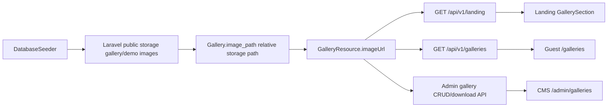

# Gallery API Dynamic Images Plan

## I. Executive Summary

- **Goal**: Remove gallery mock fallbacks from CMS and guest pages so every gallery image, caption, and gallery list state comes from the Laravel API and seeded API-owned image files.
- **Success Metrics**:
  - `rg 'galleryItems|/gallery/summit-push-at-dawn|/landing/gallery-' src/app src/components src/lib` finds no active gallery mock fallback used by landing, `/galleries`, or `/admin/galleries`.
  - Seeded gallery records expose working API image URLs backed by Laravel public storage, and the admin download endpoint downloads the stored file.
  - Frontend build, lint, Laravel formatter, and Laravel tests pass.

## II. Skill Matrix

| Component | Required Skill | Implementation Role |
|-----------|----------------|---------------------|
| Multi-step implementation sequencing | `planner` | Defines staged backend/frontend execution and exact verification steps before code changes. |
| Guest gallery and CMS visual states | `frontend-design` | Keeps gallery empty, loading, and error states polished and consistent with the existing Puncak Traveller interface. |
| Next.js route/data-fetching changes | Repository `AGENTS.md` | Requires reading relevant `node_modules/next/dist/docs/` guidance before modifying Next.js code. |
| Laravel API and seed data | Existing Laravel conventions | Updates `GalleryResource`, gallery controller behavior, and seeders using the existing API shape. |

## III. Logic & Architecture

## IV. Phased Roadmap

## Stage 1: Backend Gallery Image Ownership
> **Entry Condition**: Current API gallery endpoints and seeders exist; frontend public mock images are available for migration.
> **Exit Condition**: Demo gallery seed data uses real files copied into Laravel public storage and returns API-owned image URLs.

### Module 1.1: Seed Image Assets

- [ ] [P1.1.1] Inventory Source Gallery Assets: Confirm the existing frontend `public/gallery/*.jpg` files match every seeded gallery record.
      depends_on: none
      Verify: `find /Users/aliceevr/Documents/Workspace/SV\ IPB\ University/Puncak\ Traveller/frontend-puncak-traveller/public/gallery -type f | sort` lists the seeded filenames.

- [ ] [P1.1.2] Add Backend Seeder Image Assets: Copy the approved demo gallery images into the API repo under a seeder-owned asset directory such as `database/seeders/assets/gallery/`.
      depends_on: P1.1.1
      Verify: `find database/seeders/assets/gallery -type f | wc -l` returns at least `9`.

- [ ] [P1.1.3] Refactor Gallery Seed Paths: Update `DatabaseSeeder` so each seeded gallery image is copied to `storage/app/public/gallery/demo/` and stored as a relative path like `gallery/demo/summit-push-at-dawn.jpg`.
      depends_on: P1.1.2
      Verify: `rg "'/gallery/|image_path' database/seeders/DatabaseSeeder.php` shows seeded gallery `image_path` values no longer use frontend-root `/gallery/...` paths.

### Module 1.2: API Contract and Download Safety

- [ ] [P1.2.1] Normalize Gallery Image URLs: Ensure `GalleryResource` emits storage-backed `imageUrl` values for relative paths and does not require frontend-local gallery assets.
      depends_on: P1.1.3
      Verify: `php artisan tinker --execute="echo json_encode(new App\\Http\\Resources\\GalleryResource(App\\Models\\Gallery::first()));"` includes an `imageUrl` containing `/storage/gallery/demo/`.

- [ ] [P1.2.2] Fix Gallery Controller Dependencies: Confirm all controller references used by update/download logic are imported and covered, including the `Event` model reference in gallery updates.
      depends_on: P1.2.1
      Verify: `php -l app/Http/Controllers/Api/V1/GalleryController.php` reports no syntax or class reference issue.

- [ ] [P1.2.3] Add Seeder and Gallery API Tests: Add or update tests proving seeded gallery images exist on the public disk, public gallery payloads expose working URLs, and single-image download returns a file response for seeded records.
      depends_on: P1.2.2
      Verify: `php artisan test --filter=Gallery` and `php artisan test --filter=Seeder` pass.

### 🧪 Stage 1 Test Procedures

#### Test 1.1: Seeded Images Are API-Owned
- **Type**: Integration
- **Preconditions**: API repo dependencies are installed and the test database can run migrations.
- **Steps**:
  1. Run `php artisan migrate:fresh --seed`.
  2. Query the first gallery record with `php artisan tinker --execute="dump(App\\Models\\Gallery::query()->pluck('image_path')->all());"`.
  3. Check public storage with `find storage/app/public/gallery/demo -type f | sort`.
- **Expected Result**: Gallery `image_path` values are relative `gallery/demo/...` paths and matching files exist under `storage/app/public/gallery/demo`.
- **Pass Command**: `php artisan migrate:fresh --seed`
- **Fail Indicators**: Any seeded gallery path starts with `/gallery/`, any seeded image file is missing, or seeding throws a filesystem exception.

#### Test 1.2: Gallery API Returns Stored Media
- **Type**: Integration
- **Preconditions**: Seeded gallery records exist.
- **Steps**:
  1. Run gallery API tests.
  2. Inspect one public gallery response.
  3. Request the admin download endpoint for one seeded gallery item.
- **Expected Result**: The JSON `imageUrl` points to `/storage/gallery/demo/...`, and the download response returns a downloadable image for the selected seeded item.
- **Pass Command**: `php artisan test --filter=Gallery`
- **Fail Indicators**: `imageUrl` is null, `imageUrl` points to `/gallery/...`, download redirects to the frontend, or download returns 404.

## Stage 2: Frontend Gallery API-Only Rendering
> **Entry Condition**: Stage 1 image URLs and gallery API contract are in place.
> **Exit Condition**: Landing, `/galleries`, and `/admin/galleries` render API data only, with no active mock image fallback.

### Module 2.1: Next.js Data Fetching Preparation

- [ ] [P2.1.1] Read Current Next.js Docs: Read the relevant local Next.js docs in `node_modules/next/dist/docs/` for App Router server data fetching and route handlers before editing Next code.
      depends_on: none
      Verify: Note the consulted docs in the implementation summary.

- [ ] [P2.1.2] Tighten Gallery API Types: Update `src/lib/puncak-api.ts` gallery mappings so missing `imageUrl` is handled as an API error or filtered empty item, not replaced with local mock gallery images.
      depends_on: P2.1.1, P1.2.1
      Verify: `rg 'summit-push-at-dawn|landing/gallery-' src/lib/puncak-api.ts` shows no gallery fallback usage.

### Module 2.2: Guest Gallery Surfaces

- [ ] [P2.2.1] Remove Landing Gallery Mock Fallbacks: Ensure `GallerySection` uses only `landing.galleryImages` from `GET /api/v1/landing` and preserves the current empty state when the API returns no gallery records.
      depends_on: P2.1.2
      Verify: `rg 'galleryImages|/landing/gallery-' src/components/landing src/app/page.tsx` confirms no static gallery image import drives the rendered section.

- [ ] [P2.2.2] Make `/galleries` Error and Empty States Explicit: Wrap `getGalleryItems()` in route-level error handling so API failures show an error state and empty API responses show an empty state.
      depends_on: P2.1.2
      Verify: Temporarily pointing `PUNCAK_API_BASE_URL` to an invalid URL makes `/galleries` render "Gallery could not be loaded" instead of crashing or showing mock data.

- [ ] [P2.2.3] Remove Static Gallery Data Exports: Delete or quarantine the active `galleryItems` mock array in `src/lib/reference-data.ts` if no production route imports it.
      depends_on: P2.2.2
      Verify: `rg 'galleryItems' src` finds no active route/component import of the mock array.

### Module 2.3: CMS Gallery Surface

- [ ] [P2.3.1] Remove CMS Image Fallbacks: Update `/admin/galleries` mapping and upload handling so `imageUrl` from the API is required for display and never falls back to `/gallery/summit-push-at-dawn.jpg`.
      depends_on: P2.1.2
      Verify: `rg 'summit-push-at-dawn|Math.random\\(' src/app/admin/galleries/page.tsx` returns no active fallback or generated ID.

- [ ] [P2.3.2] Remove CMS Gallery Mock Actions: Replace the "New album" toast-only mock action and link-to-event mock behavior with either API-backed behavior or hidden/commented code until a real endpoint exists.
      depends_on: P2.3.1
      Verify: Clicking visible CMS gallery controls performs API work, opens the file picker, edits a caption, downloads, deletes, or does nothing because the control is no longer visible.

- [ ] [P2.3.3] Preserve CMS Loading, Error, Empty, and Pagination States: Keep the upload tile, pagination, edit caption, delete, and download behavior while showing explicit states for loading, failed fetches, and zero API records.
      depends_on: P2.3.2
      Verify: `/admin/galleries` displays loading text during fetch, the API error card on failure, "No gallery photos yet." for empty data, and correct 15-item pagination metadata.

### 🧪 Stage 2 Test Procedures

#### Test 2.1: No Guest Gallery Mock Rendering
- **Type**: Integration
- **Preconditions**: Frontend points to a seeded API from Stage 1.
- **Steps**:
  1. Run `PUNCAK_API_BASE_URL=http://127.0.0.1:8001 yarn build`.
  2. Start the frontend and open `/`.
  3. Open `/galleries`.
  4. Inspect rendered gallery image URLs in browser devtools or page HTML.
- **Expected Result**: Gallery images on landing and `/galleries` use API-provided `/storage/gallery/demo/...` URLs; no frontend `/gallery/...` or `/landing/gallery-...` mock gallery images render.
- **Pass Command**: `yarn build`
- **Fail Indicators**: Build failure, rendered gallery mock image paths, broken images, or route crash on empty API data.

#### Test 2.2: CMS Gallery API-Only Behavior
- **Type**: Manual
- **Preconditions**: Signed in as admin and API has seeded gallery records.
- **Steps**:
  1. Open `/admin/galleries`.
  2. Confirm gallery cards load from the API.
  3. Edit one caption and reload the page.
  4. Select one photo and click Download.
  5. Delete one selected photo and reload the page.
- **Expected Result**: Captions persist through the API, one selected image downloads, deleted records stay deleted, and no mock-only "New album" or fake link-to-event action is visible.
- **Pass Command**: Manual browser verification after `yarn lint && yarn build`.
- **Fail Indicators**: Caption reverts after reload, download returns 404, deleted photo reappears without reseeding, or visible controls only show a toast with no API effect.

#### Test 2.3: Gallery Empty and Error States
- **Type**: Manual
- **Preconditions**: Frontend can be pointed at a working API and an intentionally invalid API URL.
- **Steps**:
  1. Empty the gallery table or mock an empty API response.
  2. Open `/`, `/galleries`, and `/admin/galleries`.
  3. Point `PUNCAK_API_BASE_URL` to an invalid API URL.
  4. Reload `/galleries` and `/admin/galleries`.
- **Expected Result**: Empty responses show empty-state UI; API failures show error-state UI; no stale gallery mocks appear in either case.
- **Pass Command**: Manual browser verification.
- **Fail Indicators**: Old gallery images appear during empty/error states, UI crashes, or the CMS grid shows generated placeholder cards.

## Stage 3: Final Verification and Commit Readiness
> **Entry Condition**: Backend and frontend implementation stages are complete.
> **Exit Condition**: Both repos pass quality gates and only intended gallery-related changes are staged for commit.

### Module 3.1: Automated Verification

- [ ] [P3.1.1] Run Backend Formatting and Tests: Format dirty Laravel files and run the gallery/seeder-focused and full backend test suite.
      depends_on: P1.2.3
      Verify: `vendor/bin/pint --dirty --format agent && php artisan test` passes.

- [ ] [P3.1.2] Run Frontend Lint and Build: Validate the Next.js app after removing gallery mocks.
      depends_on: P2.3.3
      Verify: `yarn lint && PUNCAK_API_BASE_URL=http://127.0.0.1:8001 yarn build` passes.

### Module 3.2: Browser Smoke Checks

- [ ] [P3.2.1] Smoke Test Guest Gallery Routes: Use the browser to inspect `/` and `/galleries` at desktop and mobile widths.
      depends_on: P3.1.2
      Verify: Screenshots show API gallery images or correct empty/error states without overlap.

- [ ] [P3.2.2] Smoke Test CMS Gallery Route: Use the browser to inspect `/admin/galleries` as admin and verify card, upload, caption edit, download, delete, empty, and error states.
      depends_on: P3.2.1
      Verify: CMS gallery interactions are API-backed and no mock-only controls are visible.

### Module 3.3: Git Review

- [ ] [P3.3.1] Review Frontend Diff: Confirm frontend changes are scoped to gallery data fetching, gallery UI states, and any required docs.
      depends_on: P3.2.2
      Verify: `git diff --stat && git diff -- src/lib src/components src/app Documentation/Plans/gallery-api-dynamic-seed-images.md` shows expected files only.

- [ ] [P3.3.2] Review Backend Diff: Confirm backend changes are scoped to gallery seed images, gallery seed logic, gallery API tests, and controller/resource fixes.
      depends_on: P3.3.1
      Verify: `git diff --stat && git diff -- database app tests` shows expected files only and leaves unrelated local files untouched.

### 🧪 Stage 3 Test Procedures

#### Test 3.1: Full Quality Gate
- **Type**: Integration
- **Preconditions**: Stages 1 and 2 are complete.
- **Steps**:
  1. In the API repo, run `vendor/bin/pint --dirty --format agent && php artisan test`.
  2. In the frontend repo, run `yarn lint && PUNCAK_API_BASE_URL=http://127.0.0.1:8001 yarn build`.
- **Expected Result**: Backend formatter completes, all backend tests pass, frontend lint passes, and frontend production build succeeds.
- **Pass Command**: `vendor/bin/pint --dirty --format agent && php artisan test && yarn lint && PUNCAK_API_BASE_URL=http://127.0.0.1:8001 yarn build`
- **Fail Indicators**: Any lint, formatting, type, build, or test failure.

#### Test 3.2: Diff Scope
- **Type**: Manual
- **Preconditions**: Full quality gate passes.
- **Steps**:
  1. Run `git status --short` in both repos.
  2. Review `git diff --stat` in both repos.
- **Expected Result**: Modified files match gallery API dynamic rendering and seeded image ownership only; pre-existing unrelated local files are not reverted or staged.
- **Pass Command**: Manual review.
- **Fail Indicators**: Unrelated refactors, reverted user files, or staged metadata not related to this gallery task.

## V. Final Verification Checklist

- [ ] API seeder copies demo gallery image files into Laravel public storage.
- [ ] Seeded `galleries.image_path` values are relative storage paths, not frontend-root `/gallery/...` paths.
- [ ] Public `/api/v1/galleries` and `/api/v1/landing` responses expose working gallery `imageUrl` values.
- [ ] Admin gallery download returns the selected stored image file.
- [ ] Landing gallery renders API images only and keeps the existing empty state.
- [ ] `/galleries` renders API images only and has explicit empty and error states.
- [ ] `/admin/galleries` renders API images only and has loading, empty, error, pagination, upload, caption edit, download, and delete behavior.
- [ ] Mock-only CMS gallery controls are removed or hidden in code comments.
- [ ] `yarn lint` passes.
- [ ] `yarn build` passes.
- [ ] `vendor/bin/pint --dirty --format agent` passes.
- [ ] `php artisan test` passes.
