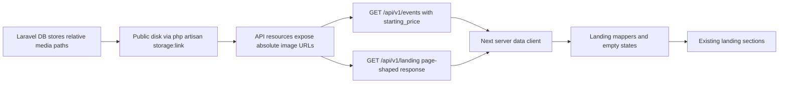

# Landing Page API Integration

## I. Executive Summary

**Goal**: Connect the Next.js landing page to the Laravel API through a stable public landing contract with backend-provided media URLs, summary pricing, landing metrics, and frontend empty states.

**Success Metrics**:
- `GET /api/v1/landing` returns all landing sections needed by the current page, with empty arrays/nulls when no content exists.
- `GET /api/v1/events` includes a nullable `starting_price` summary field and absolute `cover_image_url` while retaining relative paths in the database.
- The Next.js landing page renders API data, graceful empty states, and no broken images when the API has no seeded records.

## II. Skill Matrix

| Component | Required Skill | Implementation Role |
|-----------|----------------|---------------------|
| Planning and sequencing | `planner` | Produces the gated roadmap, dependency graph, and approval pause before implementation. |
| Laravel API changes | `laravel-best-practices` | Guides controllers, resources, migrations, eager loading, validation, and PHPUnit coverage in the backend repo. |
| Backend routing awareness | `wayfinder-development` | Confirms route-generation implications, while using explicit HTTP URLs because the Next app is a separate repo. |
| Next.js data fetching | `frontend-design` + Next bundled docs | Preserves the current landing UI while applying Next 16 server-component data-fetching and env rules. |
| Browser verification | `webapp-testing` | Verifies the integrated page against local backend/frontend servers with Playwright and visual checks. |

## III. Logic & Architecture

The Laravel API becomes the source of landing content through one page-shaped endpoint plus reusable event-list improvements. The database continues storing relative media paths on the public disk; resources expose absolute URLs for frontend consumption.

## IV. Phased Roadmap

## Stage 1: Backend Landing Contract
> **Entry Condition**: Backend repo exists at `/Users/aliceevr/Documents/Workspace/SV IPB University/Puncak Traveller/api-puncak-traveller`; `AGENTS.md` has been read before execution; current public API tests pass.
> **Exit Condition**: The backend exposes landing-ready data, summary prices, and absolute media URLs without storing absolute URLs in the database.

### Module 1.1: Backend Preparation

- [ ] [P1.1.1] Reconfirm Backend Rules: Read `/Users/aliceevr/Documents/Workspace/SV IPB University/Puncak Traveller/api-puncak-traveller/AGENTS.md` and the local `laravel-best-practices` skill before backend edits.
      depends_on: none
      Verify: Implementation notes cite Laravel Boost testing, Pint, API Resource, and storage-link requirements from the backend instructions.

- [ ] [P1.1.2] Search Versioned Laravel Docs: Use Laravel Boost `search-docs` for API resources, storage URLs, migrations, and PHPUnit feature tests before editing backend code.
      depends_on: P1.1.1
      Verify: Notes identify the docs used for `JsonResource`, public disk URLs, and feature test patterns.

### Module 1.2: Landing Content Schema

- [ ] [P1.2.1] Add Event Landing Metadata Migration: Add `activity_type` and nullable `distance_label` columns to `events`, using constants or an enum for allowed activity values.
      depends_on: P1.1.2
      Verify: `php artisan migrate --pretend` shows only additive event columns and an index suitable for activity/status counts.

- [ ] [P1.2.2] Add Community Landing Metadata Migration: Add nullable `image_path` and unsigned `member_count` columns to `communities` so community cards can be API-driven.
      depends_on: P1.1.2
      Verify: `php artisan migrate --pretend` shows only additive community columns and preserves existing parent/child relationships.

- [ ] [P1.2.3] Update Factories for Landing Metadata: Extend `EventFactory` and `CommunityFactory` with realistic activity, distance, member count, and relative image path defaults.
      depends_on: P1.2.1, P1.2.2
      Verify: `php artisan test --compact tests/Feature/Api/V1/PublicApiEndpointTest.php` can create events and communities without manual metadata overrides.

### Module 1.3: Event Summary Resource

- [ ] [P1.3.1] Add Event Starting Price Query: Update the event index query to eager-load or aggregate the minimum ticket price as `starting_price` without N+1 detail fetches.
      depends_on: P1.2.3
      Verify: `php artisan test --compact --filter=test_public_clients_can_list_and_filter_events` confirms the list response includes the expected `starting_price`.

- [ ] [P1.3.2] Add Absolute Event Image URL: Keep `cover_image` as a relative path but expose nullable `cover_image_url` from the public disk using the app URL.
      depends_on: P1.3.1
      Verify: A feature test asserts `cover_image` remains `events/example.jpg` and `cover_image_url` starts with `http://api-puncak-traveller.test/storage/events/`.

- [ ] [P1.3.3] Expose Activity Metadata in Event Resource: Add `activity_type`, `activity_label`, and `distance_label` to event summary/detail resources.
      depends_on: P1.3.2
      Verify: `php artisan test --compact tests/Feature/Api/V1/PublicApiEndpointTest.php` asserts the event list contains these fields.

### Module 1.4: Community and Gallery Media URLs

- [ ] [P1.4.1] Add Absolute Community Image URL: Keep `communities.image_path` relative but expose nullable `image_url` and `member_count` in `CommunityResource`.
      depends_on: P1.2.3
      Verify: A feature test asserts community payloads include relative `image_path`, absolute `image_url`, and integer `member_count`.

- [ ] [P1.4.2] Add Absolute Gallery Image URL: Keep `galleries.image_path` relative but expose nullable `image_url` in `GalleryResource`.
      depends_on: P1.4.1
      Verify: A feature test asserts gallery payloads include `image_path` and absolute `image_url`.

- [ ] [P1.4.3] Ensure Public Storage Link: Run or document `php artisan storage:link` so public disk media resolves under `/storage/...`.
      depends_on: P1.4.2
      Verify: `test -L public/storage || php artisan storage:link --no-interaction` succeeds, and `public/storage` points to the public storage disk.

### Module 1.5: Landing Endpoint

- [ ] [P1.5.1] Create Landing Controller: Add an invokable public `Api\V1\LandingController` using existing API resource conventions.
      depends_on: P1.3.3, P1.4.3
      Verify: Controller compiles and returns a JSON `data` object with no authentication middleware.

- [ ] [P1.5.2] Add Landing Route: Register `GET /api/v1/landing` as `api.v1.landing` in `routes/api.php`.
      depends_on: P1.5.1
      Verify: `php artisan route:list --path=api/v1/landing` lists the route and controller.

- [ ] [P1.5.3] Build Landing Aggregation: Return `hero_stats`, `upcoming_events`, `activities`, `live_event`, `communities`, and `gallery` from efficient Eloquent queries.
      depends_on: P1.5.2
      Verify: Feature tests assert empty database responses contain empty arrays/null `live_event`, and populated database responses contain section data.

- [ ] [P1.5.4] Update OpenAPI Contract: Add `/api/v1/landing` schemas plus new event/community/gallery fields in `openapi.yaml`.
      depends_on: P1.5.3
      Verify: `rg 'landing|starting_price|cover_image_url|image_url|activity_type' openapi.yaml` returns the documented contract entries.

### Stage 1 Test Procedures

#### Test 1.1: Backend Public Contract
- **Type**: Feature
- **Preconditions**: Backend Stage 1 tasks are complete; backend `.env` points to the local test database.
- **Steps**:
  1. Run `php artisan test --compact tests/Feature/Api/V1/PublicApiEndpointTest.php`.
  2. Confirm the landing endpoint, event list, community list, and gallery list assertions pass.
- **Expected Result**: Public API tests pass and assert `starting_price`, absolute image URLs, landing payload sections, and empty database behavior.
- **Pass Command**: `php artisan test --compact tests/Feature/Api/V1/PublicApiEndpointTest.php`
- **Fail Indicators**: Missing JSON fields, N+1-prone detail fetch requirements, authentication on `/api/v1/landing`, non-absolute image URLs, or database paths stored as absolute URLs.

#### Test 1.2: Storage URL Resolution
- **Type**: Integration
- **Preconditions**: Public disk symlink exists or can be created; at least one factory-created event/gallery/community has a relative image path.
- **Steps**:
  1. Run `test -L public/storage || php artisan storage:link --no-interaction`.
  2. Run `curl -sS http://api-puncak-traveller.test/api/v1/landing`.
  3. Inspect image URL fields in the response.
- **Expected Result**: Image URL fields are absolute `http://api-puncak-traveller.test/storage/...` URLs, while DB-backed path fields remain relative.
- **Pass Command**: `test -L public/storage || php artisan storage:link --no-interaction`
- **Fail Indicators**: Missing symlink, `cover_image_url`/`image_url` is relative, DB path field contains `http`, or URL host differs from the configured API host.

#### Test 1.3: Backend Formatting
- **Type**: Static
- **Preconditions**: Backend PHP files were modified.
- **Steps**:
  1. Run `vendor/bin/pint --dirty --format agent`.
  2. Run `php artisan test --compact --filter=PublicApiEndpointTest`.
- **Expected Result**: Pint reports formatted files or no changes, and public API tests pass.
- **Pass Command**: `vendor/bin/pint --dirty --format agent && php artisan test --compact --filter=PublicApiEndpointTest`
- **Fail Indicators**: Pint syntax failure, PHPUnit failure, or unformatted PHP diffs.

## Stage 2: Frontend API Client and Data Mapping
> **Entry Condition**: Stage 1 backend contract is implemented and reachable at `http://api-puncak-traveller.test/api/v1/landing`.
> **Exit Condition**: The Next app has a typed server-side API client, mappers, image host config, and landing empty-state data model.

### Module 2.1: Next Runtime Configuration

- [ ] [P2.1.1] Add Server API Base URL Configuration: Add a non-public `PUNCAK_API_BASE_URL=http://api-puncak-traveller.test` placeholder to frontend env examples and consume it only on the server.
      depends_on: none
      Verify: `rg 'PUNCAK_API_BASE_URL' .env.example src next.config.ts` shows no `NEXT_PUBLIC_` exposure.

- [ ] [P2.1.2] Configure Remote Image Host: Update `next.config.ts` with a specific remote image pattern for `api-puncak-traveller.test` and `/storage/**`.
      depends_on: P2.1.1
      Verify: `corepack yarn lint` passes and `next.config.ts` contains only the required API media host pattern.

- [ ] [P2.1.3] Opt Landing Page into Runtime Data Access: Use the Next 16 documented runtime rendering pattern before reading `process.env.PUNCAK_API_BASE_URL`.
      depends_on: P2.1.1
      Verify: `rg 'connection\\(|PUNCAK_API_BASE_URL' src/app src/lib` shows env reads occur after request-time rendering is established.

### Module 2.2: Typed API Client

- [ ] [P2.2.1] Define API Response Types: Add TypeScript types for Laravel paginated responses, landing response sections, events, communities, galleries, and API errors.
      depends_on: P2.1.1
      Verify: `corepack yarn tsc --noEmit` reports no type errors from the new API type module.

- [ ] [P2.2.2] Build Fetch Wrapper: Create a server-only API fetch helper with timeout, JSON parsing, non-OK error handling, and endpoint joining.
      depends_on: P2.2.1
      Verify: Helper rejects malformed base URLs and failed responses without throwing unhandled render errors.

- [ ] [P2.2.3] Build Landing Fetcher: Add `getLandingPageData()` that calls `/api/v1/landing` and returns a normalized success or empty-state result.
      depends_on: P2.2.2
      Verify: `corepack yarn tsc --noEmit` confirms the page can consume normalized landing data.

### Module 2.3: UI Mappers

- [ ] [P2.3.1] Map API Events to Event Cards: Convert `upcoming_events` into existing `EventCard` props using API title, activity label, status, start/end dates, place/community location, starting price, slug links, and absolute image URLs.
      depends_on: P2.2.3
      Verify: Event cards render without direct imports from static `events` data.

- [ ] [P2.3.2] Map API Activities to Activity Cards: Convert backend activity counts to existing activity cards and render zero-count empty copy when no matching activities exist.
      depends_on: P2.2.3
      Verify: Activity cards render API counts and do not display stale static counts when the API returns zero.

- [ ] [P2.3.3] Map API Communities to Community Cards: Convert backend communities to cards using `name`, `member_count`, `description`, `slug`, and absolute `image_url`.
      depends_on: P2.2.3
      Verify: Community cards render API data or the community empty state when no communities exist.

- [ ] [P2.3.4] Map API Gallery to Gallery Items: Convert backend gallery items to existing gallery figures using `image_url`, caption, and related event/community metadata.
      depends_on: P2.2.3
      Verify: Gallery renders API media or the gallery empty state with no broken `next/image` requests.

- [ ] [P2.3.5] Map API Live Event: Convert nullable `live_event` into the live section; render an explicit idle state when no event is ongoing.
      depends_on: P2.2.3
      Verify: The live section shows API event details when present and "no live event" UI when `live_event` is null.

- [ ] [P2.3.6] Map API Hero Stats: Convert backend `hero_stats` into the existing hero stat grid, allowing missing stats to collapse cleanly.
      depends_on: P2.2.3
      Verify: Hero stat grid renders zero or more API stats without layout shift or stale static values.

### Stage 2 Test Procedures

#### Test 2.1: Frontend Type and Lint Check
- **Type**: Static
- **Preconditions**: Frontend Stage 2 tasks are complete.
- **Steps**:
  1. Run `corepack yarn lint`.
  2. Run `corepack yarn tsc --noEmit`.
- **Expected Result**: ESLint and TypeScript pass with strict types for API responses and no client-side access to server-only env variables.
- **Pass Command**: `corepack yarn lint && corepack yarn tsc --noEmit`
- **Fail Indicators**: Type errors, lint errors, `process.env.PUNCAK_API_BASE_URL` referenced in client components, or missing remote image configuration.

#### Test 2.2: API Failure Normalization
- **Type**: Integration
- **Preconditions**: API fetch helper and landing mapper exist.
- **Steps**:
  1. Temporarily run the frontend with an invalid `PUNCAK_API_BASE_URL`.
  2. Load the landing page.
  3. Inspect rendered content and terminal logs.
- **Expected Result**: The page renders section empty states and a non-fatal API error path, without crashing the route.
- **Pass Command**: `PUNCAK_API_BASE_URL=http://127.0.0.1:9 corepack yarn build`
- **Fail Indicators**: Build/runtime crash, unhandled promise rejection, raw stack trace in UI, or stale static landing cards shown as if they came from API data.

#### Test 2.3: Remote Image Allowlist
- **Type**: Integration
- **Preconditions**: Backend returns at least one absolute `/storage/...` image URL.
- **Steps**:
  1. Run `PUNCAK_API_BASE_URL=http://api-puncak-traveller.test corepack yarn build`.
  2. Start the frontend and inspect the landing page.
- **Expected Result**: Next accepts `api-puncak-traveller.test/storage/**` images and no invalid-host image errors appear.
- **Pass Command**: `PUNCAK_API_BASE_URL=http://api-puncak-traveller.test corepack yarn build`
- **Fail Indicators**: `next/image` invalid host errors, blocked remote image URLs, or missing image dimensions/fill parent layout issues.

## Stage 3: Landing Page Wiring and Empty States
> **Entry Condition**: Stage 2 typed client and mappers compile.
> **Exit Condition**: The landing route renders from API data with intentional empty states and preserves the existing visual/animation system.

### Module 3.1: Page Data Flow

- [ ] [P3.1.1] Make Home Page Async: Update `src/app/page.tsx` to fetch landing data server-side and pass mapped props to landing sections.
      depends_on: P2.3.1, P2.3.2, P2.3.3, P2.3.4, P2.3.5, P2.3.6
      Verify: `src/app/page.tsx` no longer renders API-backed sections without data props.

- [ ] [P3.1.2] Refactor Section Props: Update `HeroSection`, `EventsSection`, `ActivitiesSection`, `LiveEventSection`, `CommunitiesSection`, and `GallerySection` to receive typed props.
      depends_on: P3.1.1
      Verify: `rg 'events|activities|communities|galleryImages|heroStats|liveStats' src/components/landing/sections.tsx` shows no direct API-backed static imports.

- [ ] [P3.1.3] Preserve Static Navigation and CTA Copy: Keep header, footer, booking steps, and final CTA static unless a backend field explicitly replaces them.
      depends_on: P3.1.2
      Verify: Header/footer render unchanged and continue to use existing static nav/footer data.

### Module 3.2: Empty States

- [ ] [P3.2.1] Add Events Empty State: Render a polished empty state in the upcoming adventures section when `upcoming_events` is empty.
      depends_on: P3.1.2
      Verify: Empty event response displays an intentional message and no event cards.

- [ ] [P3.2.2] Add Activities Empty State: Render zero-count activity cards or a compact empty state when the backend returns no activity counts.
      depends_on: P3.1.2
      Verify: Activity section does not reuse stale static counts and remains visually balanced.

- [ ] [P3.2.3] Add Communities Empty State: Render an empty state when no communities exist.
      depends_on: P3.1.2
      Verify: Community section has no broken cards or image requests with empty API data.

- [ ] [P3.2.4] Add Gallery Empty State: Render an empty state when no gallery media exists.
      depends_on: P3.1.2
      Verify: Gallery section does not animate an empty horizontal track.

- [ ] [P3.2.5] Add Live Event Idle State: Render an idle live section when `live_event` is null.
      depends_on: P3.1.2
      Verify: Live section no longer hardcodes "Forest Fun Run 10K" when no ongoing event exists.

### Module 3.3: Motion and Layout Integrity

- [ ] [P3.3.1] Update GSAP Selectors for Empty Sections: Ensure the smooth-scroll provider handles missing card/stat/gallery elements without errors.
      depends_on: P3.2.1, P3.2.2, P3.2.3, P3.2.4, P3.2.5
      Verify: Browser console has no GSAP selector/runtime errors with empty API data.

- [ ] [P3.3.2] Verify Responsive Text Fit: Adjust CSS only where empty-state text or API content can overflow cards/buttons on mobile.
      depends_on: P3.3.1
      Verify: Mobile viewport screenshots show no overlapping headings, buttons, card copy, or image captions.

### Stage 3 Test Procedures

#### Test 3.1: Empty API Landing Render
- **Type**: E2E
- **Preconditions**: Backend local database has no events, communities, or gallery records; frontend points to `http://api-puncak-traveller.test`.
- **Steps**:
  1. Run the backend through Laravel Herd.
  2. Run `PUNCAK_API_BASE_URL=http://api-puncak-traveller.test corepack yarn dev`.
  3. Open the frontend landing page.
  4. Inspect events, activities, live event, communities, and gallery sections.
- **Expected Result**: Each API-backed section renders an intentional empty/idle state, no stale static API-backed cards appear, and no broken images are requested.
- **Pass Command**: `PUNCAK_API_BASE_URL=http://api-puncak-traveller.test corepack yarn dev`
- **Fail Indicators**: Hardcoded old event/community/gallery content, broken image icons, uncaught console errors, or blank section gaps.

#### Test 3.2: Populated API Landing Render
- **Type**: E2E
- **Preconditions**: Backend has at least three upcoming events with ticket types, one ongoing event, three communities with image paths, and five galleries.
- **Steps**:
  1. Load the landing page.
  2. Confirm event card titles, activity counts, community names, live event title, and gallery captions match API records.
  3. Click the primary event booking CTA and inspect the generated href.
- **Expected Result**: Rendered landing content matches API records, prices use the event list `starting_price`, image URLs use the API `/storage/...` host, and event links use slug-based frontend routes.
- **Pass Command**: `PUNCAK_API_BASE_URL=http://api-puncak-traveller.test corepack yarn dev`
- **Fail Indicators**: Price requires per-event detail fetches, mismatched event slugs, local fallback images used despite API images, or layout shift from dynamic content.

#### Test 3.3: Responsive Motion Regression
- **Type**: E2E
- **Preconditions**: Stage 3 implementation is complete and frontend dev server is running.
- **Steps**:
  1. Run Playwright against desktop and mobile viewports.
  2. Wait for `networkidle`.
  3. Capture screenshots and browser console output.
- **Expected Result**: Desktop and mobile layouts have no text overlap, no GSAP/Lenis console errors, and empty/populated sections animate without hiding content permanently.
- **Pass Command**: `corepack yarn lint && PUNCAK_API_BASE_URL=http://api-puncak-traveller.test corepack yarn build`
- **Fail Indicators**: Console errors, hidden cards after animation, mobile overflow, CTA text clipping, or gallery track animation running with no gallery items.

## Stage 4: Final Verification and Documentation Sync
> **Entry Condition**: Backend and frontend implementations pass their focused tests.
> **Exit Condition**: API docs, frontend build, and integrated browser checks all pass from clean commands.

### Module 4.1: Contract Verification

- [ ] [P4.1.1] Validate API Route Output Manually: Use `curl` against `/api/v1/landing` and `/api/v1/events?status=upcoming&per_page=3` to confirm response shape.
      depends_on: P1.5.4
      Verify: Curl responses include `data`, no auth error, summary prices, absolute image URLs, and empty-state-safe arrays/nulls.

- [ ] [P4.1.2] Confirm OpenAPI Matches Runtime: Compare documented fields in `openapi.yaml` to the runtime JSON payloads.
      depends_on: P4.1.1
      Verify: Every new runtime field exists in OpenAPI and every documented required field is present in runtime payloads.

### Module 4.2: Full Local Verification

- [ ] [P4.2.1] Run Backend Focused Suite: Run the public API and booking tests affected by event/ticket query changes.
      depends_on: P4.1.2
      Verify: `php artisan test --compact tests/Feature/Api/V1/PublicApiEndpointTest.php tests/Feature/Api/V1/BookingEndpointTest.php` passes.

- [ ] [P4.2.2] Run Frontend Static Checks: Run lint, TypeScript, and production build with the local API base URL.
      depends_on: P3.3.2
      Verify: `PUNCAK_API_BASE_URL=http://api-puncak-traveller.test corepack yarn build` passes after lint and type checks.

- [ ] [P4.2.3] Run Browser Smoke Test: Start the frontend and inspect the landing page against the live local API.
      depends_on: P4.2.1, P4.2.2
      Verify: Browser screenshot shows API-backed content or empty states and browser console has no runtime errors.

### Stage 4 Test Procedures

#### Test 4.1: End-to-End Local API Contract
- **Type**: Integration
- **Preconditions**: Backend migrations are run, public storage link exists, Laravel Herd serves `http://api-puncak-traveller.test`.
- **Steps**:
  1. Run `curl -sS http://api-puncak-traveller.test/api/v1/landing`.
  2. Run `curl -sS 'http://api-puncak-traveller.test/api/v1/events?status=upcoming&per_page=3'`.
  3. Inspect `data` payloads for new fields.
- **Expected Result**: Both endpoints return `200`; event summaries include `starting_price`, `activity_type`, and `cover_image_url`; landing response contains all page sections.
- **Pass Command**: `curl -sS http://api-puncak-traveller.test/api/v1/landing && curl -sS 'http://api-puncak-traveller.test/api/v1/events?status=upcoming&per_page=3'`
- **Fail Indicators**: HTTP 500/404/401, missing fields, relative media URLs, or absolute URLs stored in path fields.

#### Test 4.2: Production Build Against Local API
- **Type**: Integration
- **Preconditions**: Frontend Stage 3 is complete; backend local API is reachable.
- **Steps**:
  1. Run `corepack yarn lint`.
  2. Run `corepack yarn tsc --noEmit`.
  3. Run `PUNCAK_API_BASE_URL=http://api-puncak-traveller.test corepack yarn build`.
- **Expected Result**: All commands pass with no Next image-host, server/client boundary, TypeScript, or fetch errors.
- **Pass Command**: `corepack yarn lint && corepack yarn tsc --noEmit && PUNCAK_API_BASE_URL=http://api-puncak-traveller.test corepack yarn build`
- **Fail Indicators**: Build-time API crash, invalid env access, remote image host rejection, TypeScript errors, or lint failures.

#### Test 4.3: Browser Landing Acceptance
- **Type**: E2E
- **Preconditions**: Backend is served by Herd and frontend dev server is running.
- **Steps**:
  1. Open the frontend landing page in a desktop viewport.
  2. Wait for network idle.
  3. Capture browser console logs.
  4. Repeat in a mobile viewport.
- **Expected Result**: Landing page shows API-backed data or intentional empty states, scroll animation remains functional, and no console errors appear.
- **Pass Command**: `PUNCAK_API_BASE_URL=http://api-puncak-traveller.test corepack yarn dev`
- **Fail Indicators**: Blank page, unhandled API error, broken images, stale static API-backed content, mobile overlap, or GSAP/Lenis runtime errors.

## V. Final Verification Checklist

- [ ] Backend `AGENTS.md` and relevant Laravel skills were read before implementation.
- [ ] `php artisan storage:link --no-interaction` has been run or confirmed existing.
- [ ] Database stores only relative media paths; API resources return absolute media URLs.
- [ ] `/api/v1/events` includes `starting_price` on list responses without per-event frontend detail fetches.
- [ ] `/api/v1/landing` returns complete section data and empty arrays/nulls for missing content.
- [ ] `openapi.yaml` documents all new endpoints and fields.
- [ ] Backend focused tests pass.
- [ ] Frontend lint, TypeScript, and build pass with `PUNCAK_API_BASE_URL=http://api-puncak-traveller.test`.
- [ ] Browser verification passes for empty and populated API data across desktop and mobile.
