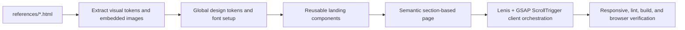

# Puncak Travellers Landing Page with GSAP + Lenis

## I. Executive Summary

**Goal**: Rebuild the Puncak Travellers landing page in Next.js with close visual fidelity to the provided HTML reference, polished responsive layouts, reusable sections/components, and expressive GSAP + Lenis scroll storytelling.

**Success Metrics**:
- The landing page matches `references/Home _ landing.html` closely across desktop while adapting cleanly to tablet and mobile.
- All landing-page sections are implemented with semantic `<section>` tags and reusable React components.
- Lenis smooth scrolling and GSAP ScrollTrigger animations run without hydration errors, memory leaks, layout overlap, or production markers.

## II. Skill Matrix

| Component | Required Skill | Implementation Role |
|-----------|----------------|---------------------|
| Planning and sequencing | `planner` | Produces the gated roadmap, dependency graph, and test procedures before implementation. |
| Visual implementation | `frontend-design` | Converts the design brief, design system, and HTML landing reference into polished production UI. |
| Core animation | `gsap-core` | Defines load reveals, hover/click animations, and transform-based motion. |
| React animation lifecycle | `gsap-react` | Uses `@gsap/react` with scoped refs and automatic cleanup in Next.js client components. |
| Scroll animation | `gsap-scrolltrigger` | Coordinates Lenis with ScrollTrigger, pinned/scrubbed sections, parallax, and responsive reduced-motion behavior. |

## III. Logic & Architecture

The page will be composed as a server-rendered `src/app/page.tsx` that delegates interactive motion to client components where needed. Static content and reusable UI components will live in `src/components/landing/`, while motion orchestration will live in a dedicated client component/provider to avoid server-side GSAP execution.

## IV. Phased Roadmap

## Stage 1: Reference Extraction and Dependency Setup
> **Entry Condition**: The repo is a working Next.js app using Yarn 4.
> **Exit Condition**: Required animation/icon dependencies are installed and reusable reference assets/tokens are available for implementation.

### Module 1.1: Dependencies

- [ ] [P1.1.1] Install Motion Dependencies: Add `gsap`, `@gsap/react`, and `lenis` with Yarn 4.
      depends_on: none
      Verify: `corepack yarn why gsap @gsap/react lenis` returns installed package entries.

- [ ] [P1.1.2] Install Icon Dependency: Add `@tabler/icons-react` to match the design brief's Tabler outline icon direction.
      depends_on: none
      Verify: `corepack yarn why @tabler/icons-react` returns an installed package entry.

### Module 1.2: Reference Assets

- [ ] [P1.2.1] Extract Embedded JPEG Assets: Extract embedded JPEG imagery from `references/Home _ landing.html` into `public/landing/` with descriptive filenames.
      depends_on: none
      Verify: `find public/landing -type f` lists extracted `.jpg` files and each file is non-empty.

- [ ] [P1.2.2] Map Reference Imagery to Sections: Assign extracted images to hero, event cards, live event, communities, gallery, and CTA usage based on the closest visible reference placement.
      depends_on: P1.2.1
      Verify: A data module or component props reference every selected image path exactly once or intentionally reuse it.

### Module 1.3: Design Tokens

- [ ] [P1.3.1] Define Global Tokens: Update global CSS tokens for orange, teal, navy, body gray, cream, line color, radii, shadows, and layout widths from `references/Web design system.html`.
      depends_on: none
      Verify: `rg -- '--pt-|--color-|--radius-|--shadow-' src/app/globals.css` returns the expected token definitions.

- [ ] [P1.3.2] Configure Fonts: Replace the scaffold Geist setup with Bricolage Grotesque for display and Inter for body/UI using Next font loading.
      depends_on: P1.3.1
      Verify: `rg 'Bricolage|Inter|--font-display|--font-body' src/app src/components` shows the new font variables and no page-level Arial fallback remains.

### Stage 1 Test Procedures

#### Test 1.1: Dependency Install Integrity
- **Type**: Integration
- **Preconditions**: Stage 1 dependency tasks are complete.
- **Steps**:
  1. Run `corepack yarn install`.
  2. Run `corepack yarn why gsap @gsap/react lenis @tabler/icons-react`.
- **Expected Result**: Yarn completes successfully and all four packages are resolved in `yarn.lock`.
- **Pass Command**: `corepack yarn install && corepack yarn why gsap @gsap/react lenis @tabler/icons-react`
- **Fail Indicators**: Missing package entry, Yarn resolution error, peer dependency failure, or lockfile not updated.

#### Test 1.2: Asset Extraction Coverage
- **Type**: Manual
- **Preconditions**: Embedded images have been extracted into `public/landing/`.
- **Steps**:
  1. Run `find public/landing -type f -name '*.jpg' -maxdepth 1`.
  2. Open the extracted image files visually or inspect generated thumbnails.
  3. Compare the assets to the major photographic areas in `references/Home _ landing.html`.
- **Expected Result**: The extracted images cover the hero, event cards, live event, community/gallery, and CTA needs without broken or zero-byte files.
- **Pass Command**: `find public/landing -type f -name '*.jpg' -maxdepth 1 -exec test -s {} \\;`
- **Fail Indicators**: No extracted images, zero-byte files, missing hero/gallery imagery, or unusable corrupted image files.

#### Test 1.3: Token and Font Regression Check
- **Type**: Integration
- **Preconditions**: Global tokens and fonts are configured.
- **Steps**:
  1. Run `corepack yarn lint`.
  2. Inspect `src/app/layout.tsx` and `src/app/globals.css`.
- **Expected Result**: Lint passes, Bricolage Grotesque and Inter are configured, and the design-system color tokens are present.
- **Pass Command**: `corepack yarn lint`
- **Fail Indicators**: ESLint errors, missing font variables, Arial/system body fallback still driving the page, or missing design-system tokens.

## Stage 2: Reusable Component System
> **Entry Condition**: Stage 1 is complete; design tokens, fonts, and assets are available.
> **Exit Condition**: Landing-specific reusable components exist and can compose every section of the reference page.

### Module 2.1: Base UI Components

- [ ] [P2.1.1] Build Button Component: Create a reusable animated button/link component with primary, light, outline, ghost, small, and large variants.
      depends_on: P1.3.1, P1.3.2
      Verify: Component exposes typed props and all button variants used by the reference can be represented.

- [ ] [P2.1.2] Build Section Heading Component: Create a reusable heading block for eyebrow, title, lead text, and optional action.
      depends_on: P1.3.1, P1.3.2
      Verify: Component can render the "Recommended for you", "Ways to move", "Join a Puncak crew", and gallery headings.

- [ ] [P2.1.3] Build Badge and Meta Components: Create reusable status badges, filter chips, stat labels, and metadata rows using Tabler icons where appropriate.
      depends_on: P1.1.2, P1.3.1
      Verify: Badges render `Upcoming`, `Happening now`, `Completed`, `Trail Run`, `Camping`, and location/date metadata without duplicated markup.

### Module 2.2: Content Cards

- [ ] [P2.2.1] Build EventCard Component: Create a reusable event card matching the reference event cards with image, status, category, date, title, location, price, and CTA.
      depends_on: P1.2.2, P2.1.1, P2.1.3
      Verify: Three reference events can be rendered by mapping a typed event array.

- [ ] [P2.2.2] Build ActivityCard Component: Create reusable "Ways to move" cards for Trail Runs, Healthy Walks, Camping, and Wellness.
      depends_on: P2.1.3
      Verify: Four activity cards render from a typed activity array and preserve count labels.

- [ ] [P2.2.3] Build CommunityCard Component: Create reusable sub-community cards for Puncak Runners, Campers, and Walkers.
      depends_on: P2.1.1, P2.1.3
      Verify: Three community cards render from a typed community array with member counts and CTA.

- [ ] [P2.2.4] Build BookingStep Component: Create reusable numbered process cards for the three booking steps.
      depends_on: P2.1.2
      Verify: Step labels render as `01`, `02`, and `03` without layout overflow on narrow screens.

### Module 2.3: Section Components

- [ ] [P2.3.1] Build Header and Footer Components: Create reusable header/footer components using the existing logo and placeholder route hrefs.
      depends_on: P2.1.1
      Verify: Header nav links point to placeholder routes and footer columns match reference labels.

- [ ] [P2.3.2] Build HeroSection Component: Create a semantic `<section>` hero with the reference headline, stats, region chip, CTA, and full-bleed warm mountain imagery.
      depends_on: P1.2.2, P2.1.1, P2.1.3
      Verify: Hero has one `<section>` root, one `h1`, and no nested UI cards inside decorative cards.

- [ ] [P2.3.3] Build EventsSection Component: Create a semantic `<section>` for recommended upcoming adventures using `EventCard`.
      depends_on: P2.2.1, P2.1.2
      Verify: Section contains exactly three event cards and a "See all events" placeholder link.

- [ ] [P2.3.4] Build ActivitiesSection Component: Create a semantic `<section>` for "Ways to move" using `ActivityCard`.
      depends_on: P2.2.2, P2.1.2
      Verify: Section contains four activity cards with responsive grid behavior.

- [ ] [P2.3.5] Build LiveEventSection Component: Create a semantic `<section>` for the happening-now event with live stats and CTA buttons.
      depends_on: P2.1.1, P2.1.3, P1.2.2
      Verify: Section renders 480, 10K, and 07:00 stats with no hardcoded inline styles.

- [ ] [P2.3.6] Build CommunitiesSection Component: Create a semantic `<section>` for community cards.
      depends_on: P2.2.3, P2.1.2
      Verify: Section contains three mapped community cards and an "All communities" placeholder route.

- [ ] [P2.3.7] Build BookingStepsSection Component: Create a semantic `<section>` for the three-step booking flow.
      depends_on: P2.2.4
      Verify: Section uses mapped data for all three steps and preserves reference copy.

- [ ] [P2.3.8] Build GallerySection Component: Create a semantic `<section>` with extracted reference images and an "Open gallery" placeholder route.
      depends_on: P1.2.2, P2.1.1, P2.1.2
      Verify: Section includes multiple responsive images with descriptive alt text.

- [ ] [P2.3.9] Build FinalCtaSection Component: Create a semantic `<section>` for the final CTA with extracted imagery and two CTA buttons.
      depends_on: P1.2.2, P2.1.1
      Verify: Section renders "Ready to meet the mountains?" and both CTA actions.

### Stage 2 Test Procedures

#### Test 2.1: Component Composition
- **Type**: Integration
- **Preconditions**: All Stage 2 components are created.
- **Steps**:
  1. Run `corepack yarn lint`.
  2. Run `rg '<section' src/components src/app/page.tsx`.
  3. Run `rg 'href=\"/(events|communities|galleries|about|login|signup)' src/components src/app/page.tsx`.
- **Expected Result**: Lint passes, every page section is represented by a semantic `<section>`, and placeholder routes are wired for nav/CTA links.
- **Pass Command**: `corepack yarn lint`
- **Fail Indicators**: Type/lint errors, major content implemented as anonymous `
` roots instead of `<section>`, or missing placeholder routes.

#### Test 2.2: Reuse Coverage
- **Type**: Manual
- **Preconditions**: Stage 2 card and section components exist.
- **Steps**:
  1. Inspect `src/components/landing/`.
  2. Confirm event, activity, community, and booking-step content is rendered from arrays.
  3. Confirm card components are reused rather than duplicated per item.
- **Expected Result**: Repeated UI is implemented through reusable components and typed data structures.
- **Pass Command**: `rg 'map\\(' src/components/landing src/app/page.tsx`
- **Fail Indicators**: Duplicated card markup, hardcoded repeated item blocks, or components that cannot be reused on future pages.

#### Test 2.3: Empty/Edge Content Resilience
- **Type**: Manual
- **Preconditions**: Reusable card components are implemented.
- **Steps**:
  1. Temporarily test a long title in one event card.
  2. Temporarily test a free price and a paid price.
  3. Inspect card layout at mobile width.
- **Expected Result**: Long text wraps cleanly, price variants render correctly, and card dimensions do not shift incoherently.
- **Pass Command**: `corepack yarn lint`
- **Fail Indicators**: Text overflow, card height collapse, CTA overlap, or missing alt text.

## Stage 3: Page Assembly and Responsive Fidelity
> **Entry Condition**: Stage 2 reusable components are complete.
> **Exit Condition**: The landing page replaces the starter scaffold and closely matches the reference across desktop, tablet, and mobile.

### Module 3.1: Page Assembly

- [ ] [P3.1.1] Replace Starter Page: Replace the default Next starter content in `src/app/page.tsx` with the composed landing page sections in reference order.
      depends_on: P2.3.1, P2.3.2, P2.3.3, P2.3.4, P2.3.5, P2.3.6, P2.3.7, P2.3.8, P2.3.9
      Verify: `rg 'To get started|Deploy Now|Documentation' src/app/page.tsx src/components` returns no scaffold copy.

- [ ] [P3.1.2] Update Metadata: Set page metadata title and description for Puncak Travellers.
      depends_on: P3.1.1
      Verify: `rg 'Puncak Travellers|healthy adventures' src/app/layout.tsx` returns updated metadata.

### Module 3.2: Desktop Fidelity

- [ ] [P3.2.1] Match Desktop Layout: Tune desktop spacing, typography scale, section rhythm, rounded photography, nav treatment, event cards, and footer to closely reproduce `references/Home _ landing.html`.
      depends_on: P3.1.1
      Verify: Browser screenshot at 1440px width visually matches the provided landing reference structure and hierarchy.

- [ ] [P3.2.2] Match Design System Details: Apply color, border, card, button, badge, and typography details from `references/Web design system.html`.
      depends_on: P3.2.1
      Verify: Buttons, chips, and cards use design-system colors and radii instead of generic Tailwind defaults.

### Module 3.3: Responsive Layout

- [ ] [P3.3.1] Build Tablet Layout: Create tablet breakpoints that preserve hierarchy while reducing grid density and keeping imagery inspectable.
      depends_on: P3.2.2
      Verify: Browser screenshot at 768px width has no horizontal overflow or overlapping text.

- [ ] [P3.3.2] Build Mobile Layout: Create mobile layouts for hero, cards, live event, booking steps, gallery, CTA, header, and footer.
      depends_on: P3.3.1
      Verify: Browser screenshot at 390px width has no horizontal overflow, clipped buttons, or overlapping sections.

- [ ] [P3.3.3] Implement Mobile Navigation: Add a polished mobile navigation pattern with animated open/close gestures and placeholder routes.
      depends_on: P2.3.1, P3.3.2
      Verify: Opening and closing the mobile menu animates and all links remain keyboard reachable.

### Stage 3 Test Procedures

#### Test 3.1: Scaffold Replacement
- **Type**: Integration
- **Preconditions**: Page assembly is complete.
- **Steps**:
  1. Run `rg 'To get started|Deploy Now|Create Next App|next.svg|vercel.svg' src`.
  2. Run `corepack yarn lint`.
- **Expected Result**: No default scaffold content remains and lint passes.
- **Pass Command**: `! rg 'To get started|Deploy Now|Create Next App|next.svg|vercel.svg' src && corepack yarn lint`
- **Fail Indicators**: Starter content remains, lint errors, or metadata still references Create Next App.

#### Test 3.2: Responsive Visual Pass
- **Type**: Manual
- **Preconditions**: Local dev server is running.
- **Steps**:
  1. Open the landing page at 1440px viewport.
  2. Open the landing page at 768px viewport.
  3. Open the landing page at 390px viewport.
  4. Inspect hero, events, activity cards, live event, communities, booking steps, gallery, CTA, and footer.
- **Expected Result**: Content hierarchy matches the reference on desktop and adapts neatly on tablet/mobile without overlap or horizontal scroll.
- **Pass Command**: `corepack yarn dev`
- **Fail Indicators**: Horizontal scrollbar, clipped text, unreadable buttons, missing imagery, broken grid, or sections visually colliding.

#### Test 3.3: Placeholder Route Behavior
- **Type**: Manual
- **Preconditions**: Page assembly and responsive navigation are complete.
- **Steps**:
  1. Hover each desktop nav link and CTA.
  2. Open mobile menu.
  3. Click nav links and CTA links.
- **Expected Result**: Hover/click gestures animate, links point to placeholder routes, and the mobile menu opens/closes smoothly.
- **Pass Command**: `corepack yarn dev`
- **Fail Indicators**: Dead controls, missing `href`, broken mobile menu, instant/unanimated gestures, or focus traps.

## Stage 4: Lenis, GSAP, and Gesture Animation
> **Entry Condition**: Stage 3 page layout is complete and stable.
> **Exit Condition**: Smooth scrolling, expressive scroll-driven motion, and animated hover/click gestures are implemented without SSR or cleanup issues.

### Module 4.1: Lenis + ScrollTrigger Foundation

- [ ] [P4.1.1] Build SmoothScrollProvider: Create a client-only provider that initializes Lenis and syncs it with GSAP's ticker.
      depends_on: P1.1.1, P3.1.1
      Verify: Provider uses `"use client"` and does not instantiate Lenis during server render.

- [ ] [P4.1.2] Register GSAP Plugins Safely: Register `useGSAP` and `ScrollTrigger` in client-only animation code.
      depends_on: P4.1.1
      Verify: `rg 'registerPlugin\\(.*ScrollTrigger|registerPlugin\\(.*useGSAP' src` shows registration only in client modules.

- [ ] [P4.1.3] Wire ScrollTrigger Updates: Ensure Lenis scroll events call `ScrollTrigger.update` and cleanup destroys Lenis on unmount.
      depends_on: P4.1.2
      Verify: Smooth scrolling works and no duplicate scroll instances appear after hot reload.

### Module 4.2: Page Load and Section Reveals

- [ ] [P4.2.1] Implement Hero Load Timeline: Animate header, hero headline, supporting copy, CTA, stats, and hero image with an orchestrated entrance timeline.
      depends_on: P4.1.2, P3.2.1
      Verify: Hero content animates once on load and remains readable if JavaScript is delayed.

- [ ] [P4.2.2] Implement Batched Section Reveals: Use scoped GSAP/ScrollTrigger to reveal cards and headings as they enter the viewport.
      depends_on: P4.1.3, P3.3.2
      Verify: Event, activity, community, step, and gallery items animate with staggered transforms.

- [ ] [P4.2.3] Implement Reduced Motion Handling: Use `gsap.matchMedia()` to reduce or skip major animation for `prefers-reduced-motion: reduce`.
      depends_on: P4.2.1, P4.2.2
      Verify: Browser reduced-motion mode removes scrub/pin-heavy motion while preserving layout and content.

### Module 4.3: Expressive Scroll Moments

- [ ] [P4.3.1] Add Hero Parallax: Add scroll-linked hero image and foreground parallax using transform-based animation.
      depends_on: P4.2.1
      Verify: Parallax is smooth during Lenis scroll and does not move layout properties.

- [ ] [P4.3.2] Add Live Event Pinned Moment: Create a pinned/scrubbed "Happening now" section moment that animates live stats and trail imagery.
      depends_on: P4.1.3, P3.2.2
      Verify: Pinning does not overlap adjacent sections and no production markers are enabled.

- [ ] [P4.3.3] Add Gallery Scroll Movement: Add a scrubbed gallery motion treatment using transform-based horizontal or layered movement.
      depends_on: P4.1.3, P3.3.2
      Verify: Gallery motion uses `ease: "none"` for scrubbed horizontal movement and remains usable on mobile.

### Module 4.4: Gesture Animations

- [ ] [P4.4.1] Animate Button Hover and Press States: Add CSS/GSAP-safe hover and click feedback for all buttons and link buttons.
      depends_on: P2.1.1
      Verify: Primary, light, outline, ghost, small, and large variants have visible hover and press transitions.

- [ ] [P4.4.2] Animate Card Hover States: Add transform, shadow, image-scale, and badge/link motion to event, activity, community, and gallery cards.
      depends_on: P2.2.1, P2.2.2, P2.2.3, P3.3.2
      Verify: Hover states do not resize layout or cause text overlap.

- [ ] [P4.4.3] Animate Mobile Menu Gestures: Add open/close transitions, backdrop fade, and link stagger to mobile navigation.
      depends_on: P3.3.3
      Verify: Menu gestures animate, focus stays usable, and close control is accessible.

### Stage 4 Test Procedures

#### Test 4.1: GSAP + Lenis Integration
- **Type**: Integration
- **Preconditions**: SmoothScrollProvider and animation modules are implemented.
- **Steps**:
  1. Run `corepack yarn build`.
  2. Start the app with `corepack yarn dev`.
  3. Scroll through the page.
  4. Watch the browser console for hydration, ScrollTrigger, or Lenis errors.
- **Expected Result**: Build passes, smooth scrolling is active, ScrollTrigger animations sync with Lenis, and no runtime errors appear.
- **Pass Command**: `corepack yarn build`
- **Fail Indicators**: `window is not defined`, hydration mismatch, duplicate Lenis instances, ScrollTrigger markers in production UI, or scroll animations lagging behind Lenis.

#### Test 4.2: Gesture Animation Coverage
- **Type**: Manual
- **Preconditions**: Stage 4 gesture tasks are complete.
- **Steps**:
  1. Hover and click all visible buttons.
  2. Hover event cards, activity cards, community cards, and gallery images on desktop.
  3. Open and close the mobile menu on a mobile viewport.
- **Expected Result**: Every hover/click/menu gesture has a clear animated response and no animation causes layout jump.
- **Pass Command**: `corepack yarn dev`
- **Fail Indicators**: Static hover states, missing press feedback, layout shift, clipped text, or inaccessible mobile menu controls.

#### Test 4.3: Reduced Motion
- **Type**: Manual
- **Preconditions**: Reduced-motion handling is implemented.
- **Steps**:
  1. Enable `prefers-reduced-motion: reduce` in the browser or DevTools.
  2. Reload the page.
  3. Scroll through all sections.
- **Expected Result**: Major pinned/scrubbed/parallax animation is reduced or disabled, content remains visible, and page layout is unchanged.
- **Pass Command**: `corepack yarn dev`
- **Fail Indicators**: Heavy scroll animation still runs, content starts hidden, or sections collapse when motion is reduced.

## Stage 5: Final Verification and Polish
> **Entry Condition**: Stage 4 animation work is complete.
> **Exit Condition**: The implementation passes automated checks and browser verification across target viewports.

### Module 5.1: Automated Verification

- [ ] [P5.1.1] Run Lint: Run the repo lint command and fix any issues.
      depends_on: P4.4.3
      Verify: `corepack yarn lint` exits with code 0.

- [ ] [P5.1.2] Run Production Build: Run the Next.js production build and fix any SSR, type, or bundling issues.
      depends_on: P5.1.1
      Verify: `corepack yarn build` exits with code 0.

### Module 5.2: Browser Verification

- [ ] [P5.2.1] Verify Desktop Viewport: Use browser testing at 1440px to compare layout, hierarchy, images, motion, and footer against the reference.
      depends_on: P5.1.2
      Verify: Screenshot shows no overlap, broken images, missing sections, or scaffold content.

- [ ] [P5.2.2] Verify Tablet Viewport: Use browser testing at 768px to validate responsive layout, nav behavior, scroll animation, and card grids.
      depends_on: P5.2.1
      Verify: Screenshot shows no horizontal overflow and all controls are visible.

- [ ] [P5.2.3] Verify Mobile Viewport: Use browser testing at 390px to validate mobile sections, menu animation, CTA wrapping, and gallery behavior.
      depends_on: P5.2.2
      Verify: Screenshot shows no overlapping text, clipped buttons, or off-screen content.

### Module 5.3: Final Cleanup

- [ ] [P5.3.1] Remove Debug Artifacts: Ensure ScrollTrigger markers, temporary extraction scripts, console logs, and unused imports are absent.
      depends_on: P5.2.3
      Verify: `rg 'markers:\\s*true|console\\.log|TODO|debug' src` returns no production debug artifacts.

- [ ] [P5.3.2] Report Final Changed Files and Commands: Summarize implementation files, verification commands, and any residual limitations.
      depends_on: P5.3.1
      Verify: Final response includes changed file paths and test results.

### Stage 5 Test Procedures

#### Test 5.1: Full Automated Gate
- **Type**: Integration
- **Preconditions**: All implementation work is complete.
- **Steps**:
  1. Run `corepack yarn lint`.
  2. Run `corepack yarn build`.
- **Expected Result**: Both commands exit with code 0.
- **Pass Command**: `corepack yarn lint && corepack yarn build`
- **Fail Indicators**: ESLint errors, type errors, SSR errors, failed static generation, or module resolution errors.

#### Test 5.2: Cross-Viewport Landing Acceptance
- **Type**: E2E
- **Preconditions**: Local dev server is running and the landing page is implemented.
- **Steps**:
  1. Open `/` at 1440px width.
  2. Open `/` at 768px width.
  3. Open `/` at 390px width.
  4. Scroll from hero to footer at each viewport.
  5. Interact with nav, buttons, event cards, gallery items, and mobile menu.
- **Expected Result**: All sections render in order, all images load, every visible control has animated interaction feedback, and the layout remains coherent from hero through footer.
- **Pass Command**: `corepack yarn dev`
- **Fail Indicators**: Missing section, broken image, overlapping text, horizontal scroll, static gestures, console runtime error, or unresponsive mobile navigation.

#### Test 5.3: Production Debug Check
- **Type**: Integration
- **Preconditions**: Final cleanup is complete.
- **Steps**:
  1. Run `rg 'markers:\\s*true|console\\.log|TODO|debug' src`.
  2. Inspect any matches.
- **Expected Result**: No production debug artifacts remain; any intentional non-debug matches are documented.
- **Pass Command**: `! rg 'markers:\\s*true|console\\.log|TODO|debug' src`
- **Fail Indicators**: ScrollTrigger markers enabled, debug logs, temporary TODO markers, or unused development-only code.

## V. Final Verification Checklist

- [ ] `corepack yarn install` succeeds with Yarn 4.
- [ ] `corepack yarn lint` succeeds.
- [ ] `corepack yarn build` succeeds.
- [ ] Default Next.js scaffold content is fully removed.
- [ ] The desktop page closely reproduces `references/Home _ landing.html`.
- [ ] Every page section uses a semantic `<section>` root.
- [ ] Repeated UI is componentized and data-driven for reuse on future pages.
- [ ] Extracted reference images are used and load correctly.
- [ ] Placeholder routes are wired for nav and CTA links.
- [ ] Lenis smooth scrolling is integrated with GSAP ScrollTrigger.
- [ ] Hover and click gestures are animated across buttons, cards, nav, gallery, and mobile menu.
- [ ] Expressive scroll moments work without production markers or layout overlap.
- [ ] Reduced-motion users get a usable low-motion experience.
- [ ] Desktop, tablet, and mobile browser checks show no horizontal overflow, clipped text, or broken imagery.

