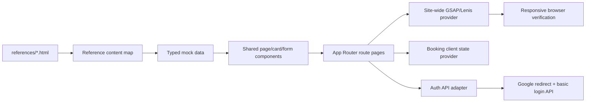

# Referenced Pages Buildout

## I. Executive Summary

**Goal**: Build every referenced Puncak Travellers page in the Next.js app with consistent reusable components, typed mock data, responsive layouts, real Google/basic auth integration, functional booking state, and GSAP/Lenis motion across the site.

**Success Metrics**:
- All approved routes render: `/`, `/events`, `/events/[slug]`, `/events/[slug]/booking`, `/events/[slug]/booking/sign-in`, `/events/[slug]/booking/confirm`, `/events/[slug]/booking/success`, `/account`, `/about`, `/galleries`, `/contact`, and `/login`.
- Repeated UI is composed from shared typed components and local mock data rather than duplicated page markup.
- `corepack yarn lint`, `corepack yarn build`, and browser checks pass with no hydration errors, broken images, overlapping text, or leaked GSAP/ScrollTrigger instances.

## II. Skill Matrix

| Component | Required Skill | Implementation Role |
|-----------|----------------|---------------------|
| Planning and sequencing | `planner` | Defines gated tasks, dependencies, and test procedures before implementation. |
| Next.js App Router | Local Next 16 docs | Preserves Server Component defaults, route folders, client boundaries, image rules, and navigation patterns. |
| Visual implementation | `frontend-design` | Converts references into polished responsive web pages while preserving the existing design system. |
| Core animation | `gsap-core` | Uses transform-based tweens, `autoAlpha`, documented eases, and reduced-motion handling. |
| React animation lifecycle | `gsap-react` | Uses scoped `useGSAP()` and cleanup-safe callbacks for client components. |
| Scroll storytelling | `gsap-scrolltrigger` | Applies top-level ScrollTriggers, Lenis coordination, refresh behavior, and production-safe marker removal. |
| Sequenced animation | `gsap-timeline` | Coordinates page-load and booking-step transitions with timelines and labels. |
| Browser verification | `webapp-testing` / Browser plugin | Verifies local routes, responsive screenshots, form flows, console health, and motion behavior. |

## III. Logic & Architecture

The current `/` landing page remains API-backed and visually intact. New routes consume typed local mock data derived from `references/` until backend endpoints exist. Shared server-rendered page components keep JavaScript small, while client islands handle motion, filters, forms, auth actions, and booking state.

## IV. Phased Roadmap

## Stage 1: Reference Contract and Site Foundations
> **Entry Condition**: User has approved the route list, mock-data approach, functional booking state, real Google/basic auth integration, local image additions, responsive derivation, and site-wide motion.
> **Exit Condition**: Implementation has a concrete content/data contract, image plan, and Next 16 architecture rules for the page buildout.

### Module 1.1: Framework and Existing Work

- [ ] [P1.1.1] Reconfirm Next 16 Page Rules: Read local docs for App Router pages, layouts, linking, Server/Client Components, image usage, and forms before code edits.
      depends_on: none
      Verify: Implementation notes cite `node_modules/next/dist/docs/01-app/01-getting-started/03-layouts-and-pages.md`, `04-linking-and-navigating.md`, `05-server-and-client-components.md`, and the image/form docs used.

- [ ] [P1.1.2] Preserve Existing Landing Contract: Keep `src/app/page.tsx`, the current landing API mapper, and landing section behavior unless shared shell or motion extraction requires small non-visual integration edits.
      depends_on: P1.1.1
      Verify: `/` still fetches landing data through `getLandingPageData()` and renders the existing section order.

- [ ] [P1.1.3] Audit Current Global Styles: Identify reusable tokens/classes in `src/app/globals.css` and record which styles become shared page primitives.
      depends_on: P1.1.1
      Verify: Notes list existing tokens for orange, teal, navy, gray, cream, line color, radii, shadows, and `--pt-wrap`.

### Module 1.2: Reference Data Contract

- [ ] [P1.2.1] Extract Reference Content Map: Convert visible copy from `About.html`, `Accounts.html`, `Contact.html`, `Event Detail.html`, `Events.html`, `Galleries.html`, `Login.html`, `Select Ticket.html`, `Sign-in to Book.html`, `Confirm.html`, and `Success.html` into a concise route-by-route content map.
      depends_on: P1.1.3
      Verify: A local notes block or data module accounts for every referenced page title, primary section, CTA, and repeated footer/navigation label.

- [ ] [P1.2.2] Define Typed Mock Models: Create TypeScript types for event summaries, event detail, ticket tiers, booking summary, gallery items, account bookings, contact methods, stats, and static page sections.
      depends_on: P1.2.1
      Verify: `corepack yarn tsc --noEmit` accepts the data model imports with `strict` mode enabled.

- [ ] [P1.2.3] Build Mock Data Module: Add typed mock data from the references under a shared `src/lib` or `src/data` module, with no backend-only imports and no duplicated hardcoded page arrays.
      depends_on: P1.2.2
      Verify: `rg 'Puncak Trail Run 2026|Alex Puncak|Summit push at dawn' src` shows source strings centralized in the mock data module or deliberate page-specific copy only.

### Module 1.3: Image and Asset Plan

- [ ] [P1.3.1] Add Local Image Assets: Add new local image files under `public/` with descriptive filenames for event detail, event listing, gallery grid, account cards, contact/about heroes, and auth/booking backgrounds.
      depends_on: P1.2.1
      Verify: `find public -type f \( -name '*.jpg' -o -name '*.png' -o -name '*.webp' \)` lists the new assets and every file is non-empty.

- [ ] [P1.3.2] Attach Alt Metadata: Pair every new image path in mock data with descriptive alt text matching the image purpose.
      depends_on: P1.3.1
      Verify: `rg 'alt|imageAlt' src` shows every local image reference has matching alt metadata.

- [ ] [P1.3.3] Avoid Magic Visual Values: Move new repeated colors, spacing, shadows, and radii into CSS variables or reusable component classes instead of inline numeric one-offs.
      depends_on: P1.1.3
      Verify: `rg 'style=\\{\\{' src` returns no layout-critical hardcoded values except typed CSS custom properties for stagger indexes or dynamic state.

### Stage 1 Test Procedures

#### Test 1.1: Reference Coverage Audit
- **Type**: Manual
- **Preconditions**: Reference content map and mock data module are complete.
- **Steps**:
  1. Compare the file list from `ls references`.
  2. Compare each referenced public page or booking step to the mock data module.
  3. Confirm `/` is intentionally preserved and not replaced by `Landing Page.html`.
- **Expected Result**: Every reference except the design brief/design system maps to a route or shared data structure, and `/` remains the current API-backed landing page.
- **Pass Command**: `ls references && rg 'Puncak Trail Run 2026|Alex Puncak|Say halo|Moments at the puncak' src`
- **Fail Indicators**: Missing route content, copied HTML export markup, duplicated page arrays, or accidental replacement of the current landing page.

#### Test 1.2: Asset Integrity
- **Type**: Integration
- **Preconditions**: New local assets have been added.
- **Steps**:
  1. Run `find public -type f \( -name '*.jpg' -o -name '*.png' -o -name '*.webp' \) -exec test -s {} \;`.
  2. Run `rg '/landing/|/events/|/gallery/|/pages/' src`.
  3. Inspect any new image directory visually.
- **Expected Result**: All new image files are non-empty, referenced by mock data or components, and visually suitable for the page they support.
- **Pass Command**: `find public -type f \( -name '*.jpg' -o -name '*.png' -o -name '*.webp' \) -exec test -s {} \;`
- **Fail Indicators**: Zero-byte files, broken references, missing alt text, or images that do not match the route context.

#### Test 1.3: Static Type Contract
- **Type**: Static
- **Preconditions**: Type definitions and mock data are implemented.
- **Steps**:
  1. Run `corepack yarn tsc --noEmit`.
  2. Run `corepack yarn lint`.
- **Expected Result**: TypeScript and ESLint pass with strict typed mock data and no client/server import violations.
- **Pass Command**: `corepack yarn tsc --noEmit && corepack yarn lint`
- **Fail Indicators**: Type widening to `any`, missing required data fields, server-only import in a client component, or lint failures.

## Stage 2: Shared Components, Layouts, and Motion
> **Entry Condition**: Stage 1 is complete; mock data and assets are available.
> **Exit Condition**: Shared UI primitives, page shell, form primitives, booking shell, and site-wide motion foundation are ready for route assembly.

### Module 2.1: Site Shell

- [ ] [P2.1.1] Generalize Header Navigation: Update shared header links so they match the approved routes and remain usable on every page.
      depends_on: P1.2.3
      Verify: `rg 'Home|Events|Communities|Galleries|About|Log in|Sign up' src/components` shows one shared navigation source.

- [ ] [P2.1.2] Generalize Footer: Keep the existing footer content consistent across all public pages and ensure links use approved route paths or deliberate placeholders.
      depends_on: P2.1.1
      Verify: Footer appears on `/events`, `/events/puncak-trail-run-2026`, `/about`, `/galleries`, and `/contact`.

- [ ] [P2.1.3] Create Public Page Shell: Add a reusable shell that wraps public pages with header, main, footer, and optional hero spacing without touching auth/checkout screens.
      depends_on: P2.1.2
      Verify: Public route pages import one shell or layout helper instead of duplicating header/footer markup.

### Module 2.2: Shared UI Components

- [ ] [P2.2.1] Extract Page Hero Component: Build a reusable hero/header block for events, about, galleries, contact, account, and event detail pages.
      depends_on: P1.3.2
      Verify: Component supports eyebrow, title, lead, metadata, optional image, and actions without nested cards.

- [ ] [P2.2.2] Extract Filter Controls: Build reusable search, segmented filter, and sort controls for the events and gallery pages.
      depends_on: P1.2.3
      Verify: Controls render accessible labels and typed option values.

- [ ] [P2.2.3] Extract Listing Cards: Build reusable event-list, gallery, account-booking, stat, feature, schedule, and included-item components.
      depends_on: P1.2.3, P1.3.2
      Verify: Events listing, event detail, galleries, account, and about pages can render from mapped arrays.

- [ ] [P2.2.4] Extract Form Primitives: Build shared input, textarea, checkbox, field error, submit button, and form panel components.
      depends_on: P1.3.3
      Verify: Contact, login, booking sign-in, and confirm forms use the same primitives.

- [ ] [P2.2.5] Extract Checkout Shell: Build reusable checkout stepper, order summary, secure header, and booking panel components for the four booking pages.
      depends_on: P2.2.3, P2.2.4
      Verify: Ticket, sign-in, confirm, and success screens share checkout layout components.

### Module 2.3: Site-Wide Motion

- [ ] [P2.3.1] Generalize Motion Provider: Move landing-only GSAP/Lenis setup into a reusable site motion provider that can wrap all approved pages while preserving Server Component boundaries.
      depends_on: P1.1.1, P2.1.3
      Verify: GSAP and Lenis imports live only in client components with `"use client"`.

- [ ] [P2.3.2] Add Scoped Reveal Selectors: Standardize `js-reveal`, `js-card`, `js-hero-item`, and checkout transition hooks so motion applies consistently without selectors leaking across pages.
      depends_on: P2.3.1
      Verify: `rg 'js-reveal|js-card|js-hero-item' src` shows scoped usage inside the provider root.

- [ ] [P2.3.3] Add Reduced-Motion Behavior: Use `gsap.matchMedia()` and `prefers-reduced-motion` to disable heavy motion and clear hidden states.
      depends_on: P2.3.2
      Verify: Reduced-motion browser emulation shows all content visible with no pinned or scrubbed animations.

- [ ] [P2.3.4] Add Page Transition Timeline Hooks: Use GSAP timelines for page-entry and checkout-step sequences with documented eases, transform aliases, and no production markers.
      depends_on: P2.3.2
      Verify: `rg 'markers:\\s*true|delay:' src/components src/app` returns no production ScrollTrigger markers and no timeline sequencing by scattered delays.

### Stage 2 Test Procedures

#### Test 2.1: Shared Component Reuse
- **Type**: Static
- **Preconditions**: Stage 2 components are implemented.
- **Steps**:
  1. Run `corepack yarn lint`.
  2. Run `rg 'export function .*Shell|export function .*Card|export function .*Field' src/components`.
  3. Inspect page route files for duplicated header/footer/form/card markup.
- **Expected Result**: Lint passes and repeated UI is represented by shared components instead of per-page markup copies.
- **Pass Command**: `corepack yarn lint`
- **Fail Indicators**: Duplicated page shell markup, repeated card structures, inconsistent form fields, or lint errors.

#### Test 2.2: Motion Lifecycle Safety
- **Type**: Integration
- **Preconditions**: Motion provider and selectors are implemented.
- **Steps**:
  1. Run `corepack yarn build`.
  2. Start the app with `corepack yarn dev`.
  3. Navigate between `/`, `/events`, `/galleries`, `/about`, and `/login`.
  4. Observe browser console for hydration, GSAP, Lenis, or ScrollTrigger errors.
- **Expected Result**: Build succeeds, route navigation works, no SSR access to `window` occurs, and no stale ScrollTriggers run after navigation.
- **Pass Command**: `corepack yarn build`
- **Fail Indicators**: Hydration mismatch, `window is not defined`, duplicated Lenis ticking, lingering pinned sections, or console errors.

#### Test 2.3: Reduced Motion
- **Type**: Manual
- **Preconditions**: Motion provider is active.
- **Steps**:
  1. Enable `prefers-reduced-motion: reduce` in browser emulation.
  2. Open `/events`, `/events/puncak-trail-run-2026`, `/galleries`, and `/events/puncak-trail-run-2026/booking`.
  3. Confirm all content is visible without scroll-pinned behavior.
- **Expected Result**: All animated elements render visible, no content remains `visibility:hidden`, and checkout remains usable.
- **Pass Command**: `corepack yarn build`
- **Fail Indicators**: Hidden content, inaccessible checkout controls, pinned sections still active, or motion-triggered layout jumps.

## Stage 3: Public Discovery Pages
> **Entry Condition**: Stage 2 shared shell, components, motion provider, assets, and mock data are complete.
> **Exit Condition**: Events listing, event detail, about, galleries, contact, account, and login routes render responsive polished pages.

### Module 3.1: Events Pages

- [ ] [P3.1.1] Build Events Listing Route: Add `src/app/events/page.tsx` with search, status counts, activity filters, sort control, event cards, load-more UI, and mock-data rendering.
      depends_on: P2.1.3, P2.2.2, P2.2.3
      Verify: `/events` displays all 8 reference events and filter controls without client errors.

- [ ] [P3.1.2] Add Events Client Filtering: Add a focused client component for search, status, activity, and sort state without converting the whole page to a Client Component.
      depends_on: P3.1.1
      Verify: Searching `West Java`, selecting `Trail runs`, and switching status filters updates visible cards.

- [ ] [P3.1.3] Build Event Detail Route: Add `src/app/events/[slug]/page.tsx` for `puncak-trail-run-2026` with event metadata, included items, schedule, map/location block, ticket sidebar, organiser panel, and save action state.
      depends_on: P2.1.3, P2.2.3, P3.1.1
      Verify: `/events/puncak-trail-run-2026` renders reference content and links `Book this run` to `/events/puncak-trail-run-2026/booking`.

- [ ] [P3.1.4] Add Event Detail Not Found Handling: Render a clear `notFound()` state for unknown slugs.
      depends_on: P3.1.3
      Verify: `/events/unknown-event` returns the app not-found UI instead of a broken page.

### Module 3.2: Content and Utility Pages

- [ ] [P3.2.1] Build About Route: Add `/about` with story hero, purpose section, values grid, stats, and shared footer.
      depends_on: P2.1.3, P2.2.1, P2.2.3
      Verify: `/about` includes "We bring people to the mountains" and all four trail rules.

- [ ] [P3.2.2] Build Galleries Route: Add `/galleries` with category/year filters, responsive image grid, captions, and load-more UI.
      depends_on: P2.1.3, P2.2.2, P2.2.3, P1.3.2
      Verify: `/galleries` displays all reference gallery captions and filters update visible items.

- [ ] [P3.2.3] Build Contact Route: Add `/contact` with contact methods and a local client-side contact form that validates required fields and shows a success state without network submission until a backend contact endpoint exists.
      depends_on: P2.1.3, P2.2.4
      Verify: Submitting empty fields shows field errors; valid input shows a sent/success state and does not perform a failed network request.

- [ ] [P3.2.4] Build Account Route: Add `/account` with profile summary, stat cards, booking tabs, upcoming/past/saved sections, and account action buttons driven by mock data.
      depends_on: P2.1.3, P2.2.3
      Verify: `/account` displays Alex Puncak, two upcoming bookings, one completed booking preview, and tab switching state.

- [ ] [P3.2.5] Build Login Route: Add `/login` with only Google and email/password login methods, removing Instagram UI from the reference.
      depends_on: P2.2.4
      Verify: `/login` shows `Continue with Google`, email/password fields, remember-me, forgot-password, and no Instagram option.

### Module 3.3: SEO and Route Metadata

- [ ] [P3.3.1] Add Page Metadata: Add route-level metadata for events, event detail, about, galleries, contact, account, and login.
      depends_on: P3.1.1, P3.1.3, P3.2.1, P3.2.2, P3.2.3, P3.2.4, P3.2.5
      Verify: `rg 'metadata|generateMetadata' src/app` shows each public route has a title/description.

- [ ] [P3.3.2] Add Loading Boundaries Where Useful: Add lightweight `loading.tsx` for dynamic event detail and booking routes if route transitions need immediate feedback.
      depends_on: P3.1.3
      Verify: Navigating to event detail from `/events` shows stable transition feedback under slow network throttling.

### Stage 3 Test Procedures

#### Test 3.1: Public Route Smoke Test
- **Type**: E2E
- **Preconditions**: Stage 3 pages are implemented and the dev server is running.
- **Steps**:
  1. Open `/events`.
  2. Open `/events/puncak-trail-run-2026`.
  3. Open `/about`.
  4. Open `/galleries`.
  5. Open `/contact`.
  6. Open `/account`.
  7. Open `/login`.
- **Expected Result**: Each route renders the expected reference-derived title, shared layout where appropriate, no broken images, and no console errors.
- **Pass Command**: `corepack yarn build`
- **Fail Indicators**: 404 on an approved route, missing page title, broken image, hydration error, or JavaScript exception.

#### Test 3.2: Filter and Form Behavior
- **Type**: E2E
- **Preconditions**: `/events`, `/galleries`, `/contact`, and `/account` are implemented.
- **Steps**:
  1. On `/events`, search `Pangrango` and select `Trail runs`.
  2. On `/galleries`, select `Camping` then `2026`.
  3. On `/account`, switch from `Upcoming` to `Past`.
  4. On `/contact`, submit empty fields, then submit valid sample values.
- **Expected Result**: Events/gallery/account visible content updates correctly; contact form shows validation errors for empty fields and success for valid fields.
- **Pass Command**: `corepack yarn build`
- **Fail Indicators**: Filters do nothing, stale counts, no validation errors, failed network request on contact submit, or inaccessible tab state.

#### Test 3.3: Responsive Public Pages
- **Type**: Manual
- **Preconditions**: Stage 3 pages are implemented.
- **Steps**:
  1. Inspect `/events`, `/events/puncak-trail-run-2026`, `/galleries`, `/about`, `/contact`, `/account`, and `/login` at 1440px, 1024px, 768px, 430px, and 360px widths.
  2. Check hero, cards, forms, filters, tabs, and footers for overflow.
  3. Verify text wraps inside buttons/cards and never overlaps adjacent content.
- **Expected Result**: All pages adapt cleanly across desktop/tablet/mobile with no horizontal scroll or incoherent overlap.
- **Pass Command**: `corepack yarn build`
- **Fail Indicators**: Horizontal overflow, clipped filter controls, overlapping card text, buttons with unreadable labels, or footer/nav collision.

## Stage 4: Auth Integration and Functional Booking Flow
> **Entry Condition**: Stage 3 event detail and login page exist; checkout shell components are complete.
> **Exit Condition**: Google/basic login call real auth API endpoints, and the four-step booking flow works with client state and mock booking confirmation.

### Module 4.1: Auth API Adapter

- [ ] [P4.1.1] Define Auth Endpoint Contract: Add a small auth API adapter for `GET /api/v1/auth/google/redirect`, `POST /api/v1/auth/login`, `GET /api/v1/auth/user`, and `POST /api/v1/auth/logout`, with endpoint paths centralized in constants.
      depends_on: P3.2.5
      Verify: `rg 'auth/google|auth/login|auth/user|auth/logout' src` shows endpoint strings only in the auth adapter.

- [ ] [P4.1.2] Add Auth Types and Error Handling: Define typed auth user, login payload, success response, and field/general error handling.
      depends_on: P4.1.1
      Verify: `corepack yarn tsc --noEmit` accepts typed login and user handling without `any`.

- [ ] [P4.1.3] Implement Google Sign-In Action: Wire the Google button to the auth provider/API redirect and preserve the intended return URL when starting from booking sign-in.
      depends_on: P4.1.2
      Verify: Clicking Google navigates to the configured Google auth redirect URL with a return path parameter.

- [ ] [P4.1.4] Implement Basic Login Action: Wire email/password login to the auth API adapter, show loading/error/success states, and redirect back to booking confirm or account as appropriate.
      depends_on: P4.1.2
      Verify: Invalid credentials show an API-backed error; a successful mocked or real API response redirects to the expected route.

### Module 4.2: Booking State

- [ ] [P4.2.1] Build Booking State Provider: Add a client-side provider for selected ticket quantities, derived totals, held-until timestamp, attendee details, terms acceptance, and confirmation state.
      depends_on: P2.2.5, P3.1.3
      Verify: Booking state persists across ticket, sign-in, confirm, and success steps during a same-tab booking session.

- [ ] [P4.2.2] Build Ticket Selection Route: Add `/events/[slug]/booking` with functional increment/decrement controls, disabled continue state when no tickets are selected, calculated subtotal/fee/total, and hold timer messaging.
      depends_on: P4.2.1
      Verify: Changing quantities immediately updates selected ticket rows and total price.

- [ ] [P4.2.3] Build Booking Sign-In Route: Add `/events/[slug]/booking/sign-in` with Google and basic login only, using the shared auth adapter and preserving selected tickets.
      depends_on: P4.1.4, P4.2.2
      Verify: Route shows selected booking summary and no Instagram option.

- [ ] [P4.2.4] Build Confirm Route: Add `/events/[slug]/booking/confirm` with attendee review, payment note, terms checkbox, derived booking summary, duplicate-click-safe submit state, and validation.
      depends_on: P4.2.3
      Verify: Confirm button is disabled until terms are accepted and selected tickets exist.

- [ ] [P4.2.5] Build Success Route: Add `/events/[slug]/booking/success` with generated mock booking reference, selected ticket count, view-account link, download placeholder, and add-to-calendar placeholder.
      depends_on: P4.2.4
      Verify: Successful confirmation redirects to success and displays the generated booking reference.

### Module 4.3: Booking Edge Cases

- [ ] [P4.3.1] Add Missing Selection Guard: Redirect users who open sign-in/confirm/success without selected tickets back to the ticket selection page with a clear message.
      depends_on: P4.2.5
      Verify: Directly opening `/events/puncak-trail-run-2026/booking/confirm` with empty state redirects or renders a recoverable empty-selection state.

- [ ] [P4.3.2] Add Sold-Out and Stock Guards: Prevent quantity from exceeding available stock and disable sold-out ticket controls.
      depends_on: P4.2.2
      Verify: Forest Fun Run sold-out or any zero-stock tier cannot be incremented; stock-limited tiers stop at their maximum.

- [ ] [P4.3.3] Add Unknown Event Guard: Use `notFound()` or a recoverable empty state for booking routes with unknown event slugs.
      depends_on: P4.2.5
      Verify: `/events/unknown-event/booking` does not crash and does not show unrelated event data.

### Stage 4 Test Procedures

#### Test 4.1: Booking Happy Path
- **Type**: E2E
- **Preconditions**: Stage 4 booking routes are implemented and dev server is running.
- **Steps**:
  1. Open `/events/puncak-trail-run-2026/booking`.
  2. Select 1 `21K Mountain Trail` ticket and 1 `5K Family Fun` ticket.
  3. Continue to sign in.
  4. Complete email/password login with valid API test credentials or a configured local auth success response.
  5. Accept terms on confirm.
  6. Confirm booking.
- **Expected Result**: The flow reaches `/events/puncak-trail-run-2026/booking/success`, displays `2 tickets · 21K + 5K`, and shows a booking reference.
- **Pass Command**: `corepack yarn build`
- **Fail Indicators**: State resets between steps, total does not update, login action fails silently, confirm permits missing terms, duplicate confirmation creates duplicate UI state, or success lacks reference.

#### Test 4.2: Booking Edge Cases
- **Type**: E2E
- **Preconditions**: Stage 4 guards are implemented.
- **Steps**:
  1. Open booking confirm directly without selecting tickets.
  2. Try decreasing a ticket below zero.
  3. Try increasing a tier above its available stock.
  4. Try confirming without accepting terms.
- **Expected Result**: Direct confirm recovers to selection, quantities stay within valid bounds, and confirm remains blocked until terms are accepted.
- **Pass Command**: `corepack yarn build`
- **Fail Indicators**: Negative quantity, over-stock quantity, empty success page, or confirmation without terms.

#### Test 4.3: Auth Integration
- **Type**: Integration
- **Preconditions**: Auth API adapter is configured with the backend base URL.
- **Steps**:
  1. Open `/login`.
  2. Click `Continue with Google`.
  3. Return to `/login` and submit invalid email/password credentials.
  4. Submit valid email/password credentials against the configured API.
- **Expected Result**: Google starts the real provider/API redirect, invalid basic login shows a clear error, and valid basic login updates auth state and redirects.
- **Pass Command**: `corepack yarn build`
- **Fail Indicators**: Instagram option still visible, Google button is inert, login endpoint string is duplicated in components, credentials are logged, or errors are swallowed.

## Stage 5: Final Polish, Accessibility, and Verification
> **Entry Condition**: Stages 1 through 4 are complete.
> **Exit Condition**: All routes pass automated checks, responsive browser verification, accessibility sanity checks, and visual quality review.

### Module 5.1: Accessibility and Semantics

- [ ] [P5.1.1] Audit Heading Structure: Ensure every page has one primary `h1`, section headings are ordered, and repeated cards use semantic articles/lists where appropriate.
      depends_on: P3.3.1, P4.2.5
      Verify: Browser accessibility tree shows meaningful page landmarks and headings.

- [ ] [P5.1.2] Audit Form Accessibility: Ensure labels, field errors, `aria-invalid`, disabled states, and focus order are correct for contact, login, and booking forms.
      depends_on: P3.2.3, P4.2.4
      Verify: Keyboard-only users can complete contact validation and booking confirmation.

- [ ] [P5.1.3] Audit Interactive Controls: Ensure filter chips, tabs, quantity steppers, save buttons, and mobile navigation have accessible names and visible focus states.
      depends_on: P3.2.4, P4.2.2
      Verify: `Tab`, `Enter`, and `Space` can operate all controls without mouse input.

### Module 5.2: Responsive and Visual Polish

- [ ] [P5.2.1] Verify Desktop Reference Alignment: Compare 1440px views against reference intent for spacing, density, typography, image usage, card rhythm, and CTA hierarchy.
      depends_on: P5.1.1
      Verify: Screenshots for `/events`, `/events/puncak-trail-run-2026`, `/galleries`, `/about`, `/contact`, `/account`, `/login`, and booking steps show neat consistent layouts.

- [ ] [P5.2.2] Verify Tablet and Mobile Layouts: Check all routes at 1024px, 768px, 430px, and 360px for overflow, button wrapping, filter usability, and image framing.
      depends_on: P5.2.1
      Verify: No route produces horizontal scroll or overlapping text at tested widths.

- [ ] [P5.2.3] Verify Image Rendering: Confirm every `next/image` source loads locally or through configured remote patterns and every asset has stable dimensions.
      depends_on: P5.2.2
      Verify: Browser network panel and console show no 404 image requests.

### Module 5.3: Automated Build Checks

- [ ] [P5.3.1] Run TypeScript Check: Run TypeScript with no emit after all route/component changes.
      depends_on: P5.1.3
      Verify: `corepack yarn tsc --noEmit` completes successfully.

- [ ] [P5.3.2] Run Lint: Run the configured Next ESLint rules.
      depends_on: P5.3.1
      Verify: `corepack yarn lint` completes successfully.

- [ ] [P5.3.3] Run Production Build: Run the Next production build and inspect route output for errors.
      depends_on: P5.3.2
      Verify: `corepack yarn build` completes successfully.

- [ ] [P5.3.4] Start Dev Server for User Review: Start the local dev server on an available port and provide the URL.
      depends_on: P5.3.3
      Verify: The app opens at the reported URL and all approved routes are reachable.

### Stage 5 Test Procedures

#### Test 5.1: Final Automated Verification
- **Type**: Static
- **Preconditions**: All code changes are complete.
- **Steps**:
  1. Run `corepack yarn tsc --noEmit`.
  2. Run `corepack yarn lint`.
  3. Run `corepack yarn build`.
- **Expected Result**: All commands complete with zero errors.
- **Pass Command**: `corepack yarn tsc --noEmit && corepack yarn lint && corepack yarn build`
- **Fail Indicators**: TypeScript errors, ESLint errors, Next build failures, missing image config, server/client boundary violation, or route generation failure.

#### Test 5.2: Route and Console Verification
- **Type**: E2E
- **Preconditions**: Dev server is running after a successful production build.
- **Steps**:
  1. Open `/`.
  2. Open `/events`.
  3. Open `/events/puncak-trail-run-2026`.
  4. Open `/events/puncak-trail-run-2026/booking`.
  5. Open `/events/puncak-trail-run-2026/booking/sign-in`.
  6. Open `/events/puncak-trail-run-2026/booking/confirm`.
  7. Open `/events/puncak-trail-run-2026/booking/success`.
  8. Open `/account`, `/about`, `/galleries`, `/contact`, and `/login`.
  9. Inspect console output after navigation.
- **Expected Result**: Every route renders, navigation remains responsive, and console output has no hydration, image, auth, GSAP, ScrollTrigger, or runtime errors.
- **Pass Command**: `corepack yarn build`
- **Fail Indicators**: 404, blank route, broken layout, console exception, duplicate smooth-scroll behavior, or missing route content.

#### Test 5.3: Full Booking and Forms Verification
- **Type**: E2E
- **Preconditions**: Dev server is running; auth API adapter is configured.
- **Steps**:
  1. Complete the booking happy path from ticket selection through success.
  2. Submit `/contact` empty, then with valid values.
  3. Submit `/login` with invalid basic credentials and observe error.
  4. Start Google login and confirm redirect begins.
- **Expected Result**: Booking state is functional, contact validation/success works locally, invalid login shows a clear error, and Google login starts the real provider/API flow.
- **Pass Command**: `corepack yarn build`
- **Fail Indicators**: Booking state loss, invalid totals, missing form errors, failed Google redirect, no login error feedback, or inaccessible controls.

## V. Final Verification Checklist

- [ ] `corepack yarn tsc --noEmit` passes.
- [ ] `corepack yarn lint` passes.
- [ ] `corepack yarn build` passes.
- [ ] `/` remains the existing API-backed landing page.
- [ ] All approved routes render and link correctly.
- [ ] Events and galleries filters work from client state.
- [ ] Contact form validates locally and shows success without a backend endpoint.
- [ ] Login uses only Google and email/password.
- [ ] Auth endpoint strings are centralized in the auth adapter.
- [ ] Booking flow preserves selected tickets across all four steps.
- [ ] Booking totals, stock guards, terms validation, and success reference work.
- [ ] New local images load with descriptive alt text.
- [ ] GSAP/Lenis motion applies across pages, respects reduced motion, and leaves no production markers.
- [ ] Desktop, tablet, and mobile layouts have no overlap, clipping, or horizontal overflow.
- [ ] Dev server URL is provided for manual review after implementation.
