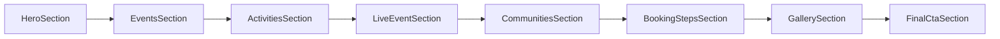
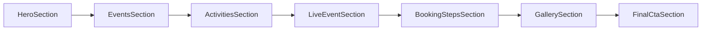

# Remove Root Community Cards UI

## I. Executive Summary

- **Goal**: Remove the community crew/cards section from the `/` landing page so the root page flows directly from live event content into booking steps.
- **Success Metrics**:
  - `/` no longer renders the "Join a Puncak crew" heading, "All communities" action, community cards grid, or "No crews published yet" empty state.
  - TypeScript and ESLint complete with zero errors introduced by this change.
  - No unrelated admin, API, or non-landing community management behavior is changed.

## II. Skill Matrix

| Component | Required Skill | Implementation Role |
|-----------|----------------|---------------------|
| Landing page UI removal | `frontend-design` | Preserve the existing refined landing-page rhythm while removing the community band cleanly. |
| App Router root page update | Next.js local docs | Use the current `app/page.tsx` route conventions from `node_modules/next/dist/docs/`. |
| Execution planning | `planner` | Keep the change scoped, dependency-ordered, and approval-gated. |

## III. Logic & Architecture

Current root rendering order:

Target root rendering order:

## IV. Phased Roadmap

## Stage 1: Remove Community Section From Root
> **Entry Condition**: The plan is approved and the current root page still renders `CommunitiesSection` from `src/components/landing/sections.tsx`.
> **Exit Condition**: The root `/` page no longer imports or renders the community section.

### Module 1.1: Root Page Composition

- [x] [P1.1.1] Remove Root Import: Delete `CommunitiesSection` from the landing sections import list in `src/app/page.tsx`.
      depends_on: none
      Verify: `rg -n "CommunitiesSection" src/app/page.tsx` returns no matches for the import name.

- [x] [P1.1.2] Remove Root Render Call: Delete `<CommunitiesSection communities={landing.communities} />` from the `/` page component.
      depends_on: P1.1.1
      Verify: `rg -n "Join a Puncak crew|No crews published yet|All communities|Community cards will appear" src/app/page.tsx src/components/landing/sections.tsx` confirms the strings remain only in the unused section module, not in `src/app/page.tsx`.

### Module 1.2: Dead Import Cleanup

- [x] [P1.2.1] Evaluate Landing Section Imports: Check whether removing root usage makes `CommunityCard`, `LandingCommunity`, or `CommunitiesSectionProps` unused inside `src/components/landing/sections.tsx`.
      depends_on: P1.1.2
      Verify: `yarn lint` reports no unused import/type errors from `src/components/landing/sections.tsx`.

- [x] [P1.2.2] Remove Newly Unused Section Code If Required: If lint flags unused community-only imports or types, delete only the unused declarations while leaving admin/community data models and routes intact.
      depends_on: P1.2.1
      Verify: `rg -n "CommunityCard|LandingCommunity|CommunitiesSectionProps" src/components/landing/sections.tsx` either shows valid in-file usage or returns no matches.

### 🧪 Stage 1 Test Procedures

#### Test 1.1: Static Route Composition Check
- **Type**: Manual
- **Preconditions**: Stage 1 tasks are complete.
- **Steps**:
  1. Open `src/app/page.tsx`.
  2. Inspect the import from `@/components/landing/sections`.
  3. Inspect the JSX returned inside `<main className="landing-main">`.
- **Expected Result**: `CommunitiesSection` is absent from the import list and no `<CommunitiesSection ... />` JSX is rendered between `LiveEventSection` and `BookingStepsSection`.
- **Pass Command**: `rg -n "CommunitiesSection|Join a Puncak crew|No crews published yet|All communities" src/app/page.tsx`
- **Fail Indicators**: Any match appears in `src/app/page.tsx`.

#### Test 1.2: Lint Regression Check
- **Type**: Integration
- **Preconditions**: Dependencies are installed and Stage 1 tasks are complete.
- **Steps**:
  1. Run the project lint command.
  2. Review any reported diagnostics.
- **Expected Result**: ESLint completes without errors introduced by the root community UI removal.
- **Pass Command**: `yarn lint`
- **Fail Indicators**: Unused imports, TypeScript parser errors, or landing-page diagnostics referencing removed community section usage.

#### Test 1.3: Browser Visual Check
- **Type**: Manual
- **Preconditions**: The Next.js dev server is running after Stage 1 tasks are complete.
- **Steps**:
  1. Open `/` in the browser.
  2. Scroll from the live event section to the booking section.
  3. Search visually for "Join a Puncak crew", "All communities", and "No crews published yet".
- **Expected Result**: The community UI shown in the provided screenshot is gone, and the next visible landing band after live event content is the booking steps section.
- **Pass Command**: `yarn dev`
- **Fail Indicators**: The community heading, action link, card grid, or empty state still appears on `/`.

## V. Final Verification Checklist

- [x] Confirm `src/app/page.tsx` no longer imports or renders `CommunitiesSection`.
- [x] Confirm no unrelated admin/community management files were changed.
- [x] Run `yarn lint`.
- [x] Run or open the app locally and verify `/` no longer shows the community cards UI.
- [x] Review `git diff -- src/app/page.tsx src/components/landing/sections.tsx` to confirm the diff is scoped to the approved removal.
